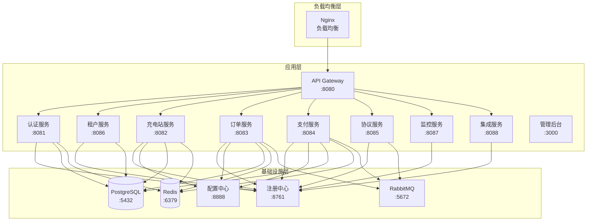

# EVCS Manager Docker 部署指南

> **版本**: v2.0 | **更新日期**: 2025-11-02 | **状态**: 活跃

## 📋 概述

本文档提供了 EVCS Manager 充电站管理平台的完整 Docker 部署方案，包括开发环境、测试环境和生产环境的部署配置。

### 🎯 部署目标
- **一键部署**: 通过 docker-compose 实现一键部署
- **环境隔离**: 支持多环境配置
- **高可用**: 支持负载均衡和故障恢复
- **监控就绪**: 集成健康检查和监控
- **扩展友好**: 支持水平扩展

## 🏗️ 架构概览

### 服务组件


## 🚀 快速开始

### 环境要求
- Docker 20.10+
- Docker Compose 2.0+
- 至少 8GB 可用内存
- 至少 10GB 可用磁盘空间

### 一键部署
```bash
# 克隆项目
git clone https://github.com/your-org/evcs-mgr.git
cd evcs-mgr

# 启动所有服务
docker-compose up -d

# 查看服务状态
docker-compose ps

# 查看日志
docker-compose logs -f
```

### 验证部署
```bash
# 检查服务健康状态
./scripts/health-check.sh

# 运行冒烟测试
./scripts/smoke-test.sh
```

## 📁 目录结构

```
evcs-mgr/
├── docker-compose.yml              # 主部署配置
├── docker-compose.override.yml     # 开发环境覆盖
├── docker-compose.prod.yml         # 生产环境配置
├── docker-compose.test.yml         # 测试环境配置
├── .env                            # 环境变量
├── .env.prod                       # 生产环境变量
├── .env.test                       # 测试环境变量
├── scripts/                        # 部署脚本
│   ├── deploy.sh                   # 部署脚本
│   ├── health-check.sh             # 健康检查
│   ├── smoke-test.sh               # 冒烟测试
│   └── backup.sh                   # 数据备份
├── monitoring/                     # 监控配置
│   ├── prometheus/                 # Prometheus配置
│   ├── grafana/                    # Grafana配置
│   └── alertmanager/               # 告警配置
├── nginx/                          # Nginx配置
│   ├── nginx.conf                  # 主配置
│   └── ssl/                        # SSL证书
└── sql/                            # 数据库脚本
    ├── init.sql                    # 初始化脚本
    └── test_data.sql               # 测试数据
```

## ⚙️ 配置详解

### 主配置文件 (docker-compose.yml)

```yaml
version: '3.8'

# 共享环境变量
x-java-env: &java-env
  JAVA_OPTS: >
    -Xms512m -Xmx512m
    -XX:+UseG1GC
    -XX:MaxGCPauseMillis=100
    -XX:+ParallelRefProcEnabled
    -XX:+UseStringDeduplication
    -XX:StartFlightRecording=dumponexit=true,filename=/tmp/flight.jfr
    -XX:FlightRecorderOptions=stackdepth=128
  SPRING_PROFILES_ACTIVE: "${SPRING_PROFILES_ACTIVE:-local}"
  CONFIG_SERVER_URL: "http://config-server:8888"
  EUREKA_SERVER_URL: "http://eureka:8761/eureka/"
  DB_HOST: "postgres"
  DB_PORT: "5432"
  DB_NAME: "${DB_NAME:-evcs_mgr}"
  DB_USER: "${DB_USER:-postgres}"
  DB_PASSWORD: "${DB_PASSWORD:-postgres}"
  SPRING_DATA_REDIS_HOST: "redis"
  SPRING_DATA_REDIS_PORT: "6379"
  SPRING_RABBITMQ_HOST: "rabbitmq"
  SPRING_RABBITMQ_PORT: "5672"
  SPRING_RABBITMQ_USERNAME: "${RABBITMQ_USER:-guest}"
  SPRING_RABBITMQ_PASSWORD: "${RABBITMQ_PASSWORD:-guest}"
  JWT_SECRET: "${JWT_SECRET:-evcs-secret-key-change-in-production}"

services:
  # 基础设施服务
  postgres:
    image: postgres:15-alpine
    container_name: evcs-postgres
    restart: unless-stopped
    environment:
      POSTGRES_DB: ${DB_NAME:-evcs_mgr}
      POSTGRES_USER: ${DB_USER:-postgres}
      POSTGRES_PASSWORD: ${DB_PASSWORD:-postgres}
      POSTGRES_INITDB_ARGS: "--encoding=UTF-8 --locale=C"
    volumes:
      - postgres_data:/var/lib/postgresql/data
      - ./sql/init.sql:/docker-entrypoint-initdb.d/01-init.sql
      - ./sql/charging_station_tables.sql:/docker-entrypoint-initdb.d/02-station.sql
    ports:
      - "${POSTGRES_PORT:-5432}:5432"
    healthcheck:
      test: ["CMD-SHELL", "pg_isready -U ${DB_USER:-postgres} -d ${DB_NAME:-evcs_mgr}"]
      interval: 10s
      timeout: 5s
      retries: 5
      start_period: 30s
    networks:
      - evcs-network
    deploy:
      resources:
        limits:
          cpus: '2'
          memory: 2G
        reservations:
          cpus: '1'
          memory: 1G

  redis:
    image: redis:7-alpine
    container_name: evcs-redis
    restart: unless-stopped
    command: >
      redis-server
      --appendonly yes
      --maxmemory ${REDIS_MAX_MEMORY:-512mb}
      --maxmemory-policy allkeys-lru
      --requirepass ${REDIS_PASSWORD:-}
    volumes:
      - redis_data:/data
      - ./redis/redis.conf:/usr/local/etc/redis/redis.conf
    ports:
      - "${REDIS_PORT:-6379}:6379"
    healthcheck:
      test: ["CMD", "redis-cli", "ping"]
      interval: 10s
      timeout: 3s
      retries: 5
      start_period: 10s
    networks:
      - evcs-network
    deploy:
      resources:
        limits:
          cpus: '1'
          memory: 512M
        reservations:
          cpus: '0.5'
          memory: 256M

  rabbitmq:
    image: rabbitmq:3-management-alpine
    container_name: evcs-rabbitmq
    restart: unless-stopped
    environment:
      RABBITMQ_DEFAULT_USER: ${RABBITMQ_USER:-guest}
      RABBITMQ_DEFAULT_PASS: ${RABBITMQ_PASSWORD:-guest}
      RABBITMQ_DEFAULT_VHOST: ${RABBITMQ_VHOST:-/}
    volumes:
      - rabbitmq_data:/var/lib/rabbitmq
      - ./rabbitmq/rabbitmq.conf:/etc/rabbitmq/rabbitmq.conf
    ports:
      - "${RABBITMQ_PORT:-5672}:5672"
      - "${RABBITMQ_MGMT_PORT:-15672}:15672"
    healthcheck:
      test: ["CMD", "rabbitmq-diagnostics", "ping"]
      interval: 10s
      timeout: 5s
      retries: 5
      start_period: 30s
    networks:
      - evcs-network
    deploy:
      resources:
        limits:
          cpus: '1'
          memory: 1G
        reservations:
          cpus: '0.5'
          memory: 512M

  # 微服务基础设施
  eureka:
    build:
      context: .
      dockerfile: evcs-eureka/Dockerfile
    container_name: evcs-eureka
    restart: unless-stopped
    environment:
      JAVA_OPTS: "-Xms256m -Xmx512m"
      SPRING_PROFILES_ACTIVE: "${SPRING_PROFILES_ACTIVE:-local}"
    ports:
      - "${EUREKA_PORT:-8761}:8761"
    volumes:
      - ./config-repo:/config-repo:ro
    healthcheck:
      test: ["CMD", "wget", "--quiet", "--tries=1", "--spider", "http://localhost:8761/actuator/health"]
      interval: 30s
      timeout: 10s
      retries: 3
      start_period: 60s
    depends_on:
      postgres:
        condition: service_healthy
      redis:
        condition: service_healthy
    networks:
      - evcs-network
    deploy:
      resources:
        limits:
          cpus: '0.5'
          memory: 512M

  config-server:
    build:
      context: .
      dockerfile: evcs-config/Dockerfile
    container_name: evcs-config
    restart: unless-stopped
    environment:
      JAVA_OPTS: "-Xms256m -Xmx512m"
      SPRING_PROFILES_ACTIVE: "${SPRING_PROFILES_ACTIVE:-local}"
      SPRING_CLOUD_CONFIG_SERVER_NATIVE_SEARCH_LOCATIONS: "file:/config-repo"
      EUREKA_CLIENT_SERVICE_URL_DEFAULTZONE: "http://eureka:8761/eureka"
    ports:
      - "${CONFIG_PORT:-8888}:8888"
    volumes:
      - ./config-repo:/config-repo:ro
    healthcheck:
      test: ["CMD", "wget", "--quiet", "--tries=1", "--spider", "http://localhost:8888/actuator/health"]
      interval: 30s
      timeout: 10s
      retries: 3
      start_period: 60s
    depends_on:
      eureka:
        condition: service_healthy
    networks:
      - evcs-network
    deploy:
      resources:
        limits:
          cpus: '0.5'
          memory: 512M

  # API网关
  gateway:
    build:
      context: .
      dockerfile: evcs-gateway/Dockerfile
    container_name: evcs-gateway
    restart: unless-stopped
    environment:
      <<: *java-env
    ports:
      - "${GATEWAY_PORT:-8080}:8080"
    volumes:
      - ./logs:/app/logs
    healthcheck:
      test: ["CMD", "wget", "--quiet", "--tries=1", "--spider", "http://localhost:8080/actuator/health"]
      interval: 30s
      timeout: 10s
      retries: 3
      start_period: 90s
    depends_on:
      config-server:
        condition: service_healthy
      eureka:
        condition: service_healthy
    networks:
      - evcs-network
    deploy:
      resources:
        limits:
          cpus: '1'
          memory: 768M
        reservations:
          cpus: '0.5'
          memory: 512M

  # 业务服务
  auth-service:
    build:
      context: .
      dockerfile: evcs-auth/Dockerfile
    container_name: evcs-auth
    restart: unless-stopped
    environment:
      <<: *java-env
    volumes:
      - ./logs:/app/logs
    healthcheck:
      test: ["CMD", "wget", "--quiet", "--tries=1", "--spider", "http://localhost:8081/actuator/health"]
      interval: 30s
      timeout: 10s
      retries: 3
      start_period: 90s
    depends_on:
      postgres:
        condition: service_healthy
      redis:
        condition: service_healthy
      config-server:
        condition: service_healthy
      eureka:
        condition: service_healthy
    networks:
      - evcs-network
    deploy:
      resources:
        limits:
          cpus: '1'
          memory: 768M
        reservations:
          cpus: '0.5'
          memory: 512M

  station-service:
    build:
      context: .
      dockerfile: evcs-station/Dockerfile
    container_name: evcs-station
    restart: unless-stopped
    environment:
      <<: *java-env
    volumes:
      - ./logs:/app/logs
    healthcheck:
      test: ["CMD", "wget", "--quiet", "--tries=1", "--spider", "http://localhost:8082/actuator/health"]
      interval: 30s
      timeout: 10s
      retries: 3
      start_period: 90s
    depends_on:
      postgres:
        condition: service_healthy
      redis:
        condition: service_healthy
      rabbitmq:
        condition: service_healthy
      config-server:
        condition: service_healthy
      eureka:
        condition: service_healthy
    networks:
      - evcs-network
    deploy:
      resources:
        limits:
          cpus: '1'
          memory: 768M
        reservations:
          cpus: '0.5'
          memory: 512M

  order-service:
    build:
      context: .
      dockerfile: evcs-order/Dockerfile
    container_name: evcs-order
    restart: unless-stopped
    environment:
      <<: *java-env
    volumes:
      - ./logs:/app/logs
    healthcheck:
      test: ["CMD", "wget", "--quiet", "--tries=1", "--spider", "http://localhost:8083/actuator/health"]
      interval: 30s
      timeout: 10s
      retries: 3
      start_period: 90s
    depends_on:
      postgres:
        condition: service_healthy
      redis:
        condition: service_healthy
      rabbitmq:
        condition: service_healthy
      config-server:
        condition: service_healthy
      eureka:
        condition: service_healthy
    networks:
      - evcs-network
    deploy:
      resources:
        limits:
          cpus: '1'
          memory: 768M
        reservations:
          cpus: '0.5'
          memory: 512M

  payment-service:
    build:
      context: .
      dockerfile: evcs-payment/Dockerfile
    container_name: evcs-payment
    restart: unless-stopped
    environment:
      <<: *java-env
    volumes:
      - ./logs:/app/logs
    healthcheck:
      test: ["CMD", "wget", "--quiet", "--tries=1", "--spider", "http://localhost:8084/actuator/health"]
      interval: 30s
      timeout: 10s
      retries: 3
      start_period: 90s
    depends_on:
      postgres:
        condition: service_healthy
      config-server:
        condition: service_healthy
      eureka:
        condition: service_healthy
    networks:
      - evcs-network
    deploy:
      resources:
        limits:
          cpus: '1'
          memory: 768M
        reservations:
          cpus: '0.5'
          memory: 512M

  # 前端服务
  admin-frontend:
    build:
      context: ./evcs-admin
      dockerfile: Dockerfile
    container_name: evcs-admin
    restart: unless-stopped
    environment:
      VUE_APP_API_BASE_URL: "http://localhost:${GATEWAY_PORT:-8080}"
    ports:
      - "${ADMIN_PORT:-3000}:80"
    healthcheck:
      test: ["CMD", "wget", "--quiet", "--tries=1", "--spider", "http://localhost:80/"]
      interval: 30s
      timeout: 10s
      retries: 3
      start_period: 30s
    depends_on:
      - gateway
    networks:
      - evcs-network
    deploy:
      resources:
        limits:
          cpus: '0.5'
          memory: 256M

volumes:
  postgres_data:
    driver: local
  redis_data:
    driver: local
  rabbitmq_data:
    driver: local
  log_data:
    driver: local

networks:
  evcs-network:
    driver: bridge
    ipam:
      config:
        - subnet: 172.20.0.0/16
```

### 环境变量配置

#### .env (开发环境)
```bash
# 环境标识
SPRING_PROFILES_ACTIVE=local
COMPOSE_PROJECT_NAME=evcs-local

# 数据库配置
POSTGRES_PORT=5432
DB_NAME=evcs_mgr
DB_USER=postgres
DB_PASSWORD=postgres

# Redis配置
REDIS_PORT=6379
REDIS_PASSWORD=
REDIS_MAX_MEMORY=512mb

# RabbitMQ配置
RABBITMQ_PORT=5672
RABBITMQ_MGMT_PORT=15672
RABBITMQ_USER=guest
RABBITMQ_PASSWORD=guest

# 应用端口
EUREKA_PORT=8761
CONFIG_PORT=8888
GATEWAY_PORT=8080
ADMIN_PORT=3000

# 安全配置
JWT_SECRET=evcs-secret-key-change-in-production

# 日志配置
LOG_LEVEL=INFO
```

#### .env.prod (生产环境)
```bash
# 环境标识
SPRING_PROFILES_ACTIVE=prod
COMPOSE_PROJECT_NAME=evcs-prod

# 数据库配置
POSTGRES_PORT=5432
DB_NAME=evcs_prod
DB_USER=evcs_user
DB_PASSWORD=${DB_PASSWORD_FROM_VAULT}

# Redis配置
REDIS_PORT=6379
REDIS_PASSWORD=${REDIS_PASSWORD_FROM_VAULT}
REDIS_MAX_MEMORY=2gb

# RabbitMQ配置
RABBITMQ_PORT=5672
RABBITMQ_MGMT_PORT=15672
RABBITMQ_USER=evcs_admin
RABBITMQ_PASSWORD=${RABBITMQ_PASSWORD_FROM_VAULT}

# 安全配置
JWT_SECRET=${JWT_SECRET_FROM_VAULT}

# 性能配置
JAVA_OPTS=-Xms1g -Xmx2g -XX:+UseG1GC -XX:MaxGCPauseMillis=100

# 日志配置
LOG_LEVEL=WARN
```

## 🚀 部署流程

### 1. 环境准备

#### 安装依赖
```bash
# 检查Docker版本
docker --version

# 检查Docker Compose版本
docker-compose --version

# 创建必要目录
mkdir -p logs monitoring/{prometheus,grafana,alertmanager} nginx/ssl
```

#### 配置环境变量
```bash
# 复制环境变量模板
cp .env.example .env

# 编辑环境变量
vim .env
```

### 2. 构建镜像

#### 本地构建
```bash
# 构建所有服务镜像
docker-compose build

# 或构建单个服务
docker-compose build gateway
docker-compose build auth-service
```

#### 生产构建
```bash
# 使用生产配置构建
docker-compose -f docker-compose.yml -f docker-compose.prod.yml build

# 推送到镜像仓库
docker-compose -f docker-compose.yml -f docker-compose.prod.yml push
```

### 3. 启动服务

#### 开发环境
```bash
# 启动基础设施
docker-compose up -d postgres redis rabbitmq

# 等待基础设施就绪
./scripts/wait-for-services.sh

# 启动配置中心和注册中心
docker-compose up -d eureka config-server

# 等待配置中心就绪
./scripts/wait-for-config.sh

# 启动所有服务
docker-compose up -d

# 查看服务状态
docker-compose ps
```

#### 生产环境
```bash
# 使用生产配置启动
docker-compose -f docker-compose.yml -f docker-compose.prod.yml up -d

# 查看服务状态
docker-compose -f docker-compose.yml -f docker-compose.prod.yml ps

# 查看日志
docker-compose -f docker-compose.yml -f docker-compose.prod.yml logs -f
```

### 4. 验证部署

#### 健康检查
```bash
#!/bin/bash
# scripts/health-check.sh

set -e

echo "开始健康检查..."

# 检查基础设施服务
echo "检查 PostgreSQL..."
docker-compose exec -T postgres pg_isready -U postgres

echo "检查 Redis..."
docker-compose exec -T redis redis-cli ping

echo "检查 RabbitMQ..."
docker-compose exec -T rabbitmq rabbitmq-diagnostics ping

# 检查应用服务
services=("eureka:8761" "config-server:8888" "gateway:8080" "auth-service:8081")

for service in "${services[@]}"; do
    name=$(echo $service | cut -d: -f1)
    port=$(echo $service | cut -d: -f2)

    echo "检查 $name..."
    docker-compose exec -T $name wget --quiet --tries=1 --spider http://localhost:$port/actuator/health
done

echo "所有服务健康检查通过！"
```

#### 冒烟测试
```bash
#!/bin/bash
# scripts/smoke-test.sh

set -e

echo "开始冒烟测试..."

# 获取认证token
echo "获取认证token..."
token=$(curl -s -X POST "http://localhost:8080/api/auth/login" \
    -H "Content-Type: application/json" \
    -d '{
        "username": "admin",
        "password": "password",
        "tenantId": 1
    }' | jq -r '.data.token')

if [ "$token" = "null" ]; then
    echo "认证失败！"
    exit 1
fi

echo "认证成功，token: ${token:0:20}..."

# 测试API接口
echo "测试充电站API..."
response=$(curl -s -X GET "http://localhost:8080/api/station?page=1&size=10" \
    -H "Authorization: Bearer $token")

station_count=$(echo $response | jq '.data.total')
echo "充电站数量: $station_count"

# 测试订单API
echo "测试订单API..."
response=$(curl -s -X GET "http://localhost:8080/api/order?page=1&size=10" \
    -H "Authorization: Bearer $token")

order_count=$(echo $response | jq '.data.total')
echo "订单数量: $order_count"

echo "冒烟测试完成！"
```

## 🔧 运维管理

### 日志管理

#### 日志配置
```yaml
# docker-compose.yml 中的日志配置
services:
  gateway:
    logging:
      driver: "json-file"
      options:
        max-size: "100m"
        max-file: "5"
        labels: "service=gateway"
    volumes:
      - ./logs:/app/logs
```

#### 日志查看
```bash
# 查看所有服务日志
docker-compose logs -f

# 查看特定服务日志
docker-compose logs -f gateway
docker-compose logs -f auth-service

# 查看最近的日志
docker-compose logs --tail=100 gateway

# 按时间查看日志
docker-compose logs --since="2023-01-01T00:00:00" gateway
```

#### 日志聚合
```yaml
# docker-compose.logging.yml
version: '3.8'

services:
  elasticsearch:
    image: docker.elastic.co/elasticsearch/elasticsearch:7.15.0
    environment:
      - discovery.type=single-node
      - "ES_JAVA_OPTS=-Xms512m -Xmx512m"
    volumes:
      - elasticsearch_data:/usr/share/elasticsearch/data
    ports:
      - "9200:9200"

  logstash:
    image: docker.elastic.co/logstash/logstash:7.15.0
    volumes:
      - ./logstash/pipeline:/usr/share/logstash/pipeline
      - ./logs:/var/log/app
    depends_on:
      - elasticsearch

  kibana:
    image: docker.elastic.co/kibana/kibana:7.15.0
    ports:
      - "5601:5601"
    depends_on:
      - elasticsearch

volumes:
  elasticsearch_data:
```

### 监控配置

#### Prometheus配置
```yaml
# monitoring/prometheus/prometheus.yml
global:
  scrape_interval: 15s
  evaluation_interval: 15s

rule_files:
  - "alert_rules.yml"

alerting:
  alertmanagers:
    - static_configs:
        - targets:
          - alertmanager:9093

scrape_configs:
  - job_name: 'evcs-services'
    consul_sd_configs:
      - server: 'consul:8500'
    relabel_configs:
      - source_labels: [__meta_consul_service]
        target_label: service
      - source_labels: [__meta_consul_node]
        target_label: node

  - job_name: 'postgres'
    static_configs:
      - targets: ['postgres-exporter:9187']

  - job_name: 'redis'
    static_configs:
      - targets: ['redis-exporter:9121']

  - job_name: 'rabbitmq'
    static_configs:
      - targets: ['rabbitmq-exporter:9419']
```

#### Grafana仪表盘
```json
{
  "dashboard": {
    "title": "EVCS Manager 监控仪表盘",
    "panels": [
      {
        "title": "服务状态",
        "type": "stat",
        "targets": [
          {
            "expr": "up{job=\"evcs-services\"}"
          }
        ]
      },
      {
        "title": "请求量",
        "type": "graph",
        "targets": [
          {
            "expr": "http_requests_total"
          }
        ]
      },
      {
        "title": "响应时间",
        "type": "graph",
        "targets": [
          {
            "expr": "http_request_duration_seconds"
          }
        ]
      }
    ]
  }
}
```

### 备份恢复

#### 数据备份脚本
```bash
#!/bin/bash
# scripts/backup.sh

set -e

BACKUP_DIR="/backup/evcs-$(date +%Y%m%d_%H%M%S)"
mkdir -p $BACKUP_DIR

echo "开始备份..."

# 备份PostgreSQL
echo "备份PostgreSQL..."
docker-compose exec -T postgres pg_dump -U postgres evcs_mgr > $BACKUP_DIR/postgres_backup.sql

# 备份Redis
echo "备份Redis..."
docker-compose exec -T redis redis-cli --rdb - > $BACKUP_DIR/redis_backup.rdb

# 备份配置文件
echo "备份配置文件..."
cp .env $BACKUP_DIR/
cp docker-compose.yml $BACKUP_DIR/

# 压缩备份
echo "压缩备份..."
tar -czf $BACKUP_DIR.tar.gz -C $(dirname $BACKUP_DIR) $(basename $BACKUP_DIR)
rm -rf $BACKUP_DIR

echo "备份完成: $BACKUP_DIR.tar.gz"
```

#### 数据恢复脚本
```bash
#!/bin/bash
# scripts/restore.sh

set -e

if [ $# -ne 1 ]; then
    echo "Usage: $0 <backup_file.tar.gz>"
    exit 1
fi

BACKUP_FILE=$1
RESTORE_DIR="/tmp/restore_$(date +%s)"

echo "开始恢复..."

# 解压备份
echo "解压备份..."
tar -xzf $BACKUP_FILE -C /tmp
BACKUP_DIR=$(tar -tzf $BACKUP_FILE | head -1 | cut -f1 -d"/")

# 停止服务
echo "停止服务..."
docker-compose down

# 恢复数据
echo "恢复PostgreSQL..."
docker-compose up -d postgres
sleep 30
docker-compose exec -T postgres psql -U postgres -c "DROP DATABASE IF EXISTS evcs_mgr;"
docker-compose exec -T postgres psql -U postgres -c "CREATE DATABASE evcs_mgr;"
docker-compose exec -T postgres psql -U postgres evcs_mgr < /tmp/$BACKUP_DIR/postgres_backup.sql

echo "恢复Redis..."
docker-compose up -d redis
sleep 10
docker-compose cp /tmp/$BACKUP_DIR/redis_backup.rdb redis:/data/dump.rdb
docker-compose restart redis

# 恢复配置
echo "恢复配置..."
cp /tmp/$BACKUP_DIR/.env ./
cp /tmp/$BACKUP_DIR/docker-compose.yml ./

# 启动所有服务
echo "启动服务..."
docker-compose up -d

echo "恢复完成！"

# 清理临时文件
rm -rf /tmp/$BACKUP_DIR /tmp/$BACKUP_FILE
```

## 🔒 安全配置

### 网络安全

#### 防火墙配置
```bash
# 仅开放必要端口
ufw allow 22/tcp    # SSH
ufw allow 80/tcp    # HTTP
ufw allow 443/tcp   # HTTPS
ufw allow 8080/tcp  # API网关
ufw allow 3000/tcp  # 管理后台
ufw enable
```

#### SSL/TLS配置
```nginx
# nginx/nginx.conf
server {
    listen 443 ssl http2;
    server_name your-domain.com;

    ssl_certificate /etc/nginx/ssl/cert.pem;
    ssl_certificate_key /etc/nginx/ssl/key.pem;
    ssl_protocols TLSv1.2 TLSv1.3;
    ssl_ciphers ECDHE-RSA-AES256-GCM-SHA512:DHE-RSA-AES256-GCM-SHA512;
    ssl_prefer_server_ciphers off;

    location / {
        proxy_pass http://gateway:8080;
        proxy_set_header Host $host;
        proxy_set_header X-Real-IP $remote_addr;
        proxy_set_header X-Forwarded-For $proxy_add_x_forwarded_for;
        proxy_set_header X-Forwarded-Proto $scheme;
    }
}
```

### 数据安全

#### 密码管理
```bash
# 使用Docker secrets
echo "your_secure_password" | docker secret create db_password -

# 或使用环境变量文件
echo "DB_PASSWORD=your_secure_password" >> .env.prod
```

#### 数据加密
```yaml
# docker-compose.prod.yml
services:
  postgres:
    environment:
      POSTGRES_PASSWORD_FILE: /run/secrets/db_password
    secrets:
      - db_password

secrets:
  db_password:
    external: true
```

## 🚨 故障排查

### 常见问题

#### 1. 服务启动失败
```bash
# 查看服务状态
docker-compose ps

# 查看服务日志
docker-compose logs service-name

# 进入容器调试
docker-compose exec service-name bash
```

#### 2. 数据库连接失败
```bash
# 检查数据库状态
docker-compose exec postgres pg_isready -U postgres

# 检查网络连接
docker-compose exec gateway ping postgres

# 查看数据库日志
docker-compose logs postgres
```

#### 3. 内存不足
```bash
# 查看资源使用情况
docker stats

# 调整JVM参数
vim docker-compose.yml

# 重启服务
docker-compose restart service-name
```

#### 4. 磁盘空间不足
```bash
# 清理Docker资源
docker system prune -a

# 清理日志文件
docker-compose exec service-name sh -c "echo '' > /app/logs/application.log"

# 扩展卷空间
docker volume ls
docker volume inspect volume_name
```

### 性能调优

#### JVM优化
```bash
# 生产环境JVM参数
JAVA_OPTS="
-Xms2g -Xmx4g
-XX:+UseG1GC
-XX:MaxGCPauseMillis=100
-XX:ParallelGCThreads=4
-XX:ConcGCThreads=2
-XX:InitiatingHeapOccupancyPercent=45
-XX:+UnlockExperimentalVMOptions
-XX:+UseCGroupMemoryLimitForHeap
"
```

#### 数据库优化
```sql
-- 调整PostgreSQL配置
ALTER SYSTEM SET shared_buffers = '256MB';
ALTER SYSTEM SET effective_cache_size = '1GB';
ALTER SYSTEM SET maintenance_work_mem = '64MB';
ALTER SYSTEM SET checkpoint_completion_target = 0.9;
SELECT pg_reload_conf();
```

## 📚 扩展部署

### 高可用部署

#### 多节点部署
```yaml
# docker-compose.ha.yml
version: '3.8'

services:
  gateway:
    image: evcs/gateway:latest
    deploy:
      replicas: 3
      update_config:
        parallelism: 1
        delay: 10s
      restart_policy:
        condition: on-failure

  postgres:
    image: postgres:15-alpine
    deploy:
      replicas: 1
      placement:
        constraints:
          - node.role == manager
```

#### 负载均衡配置
```nginx
upstream gateway_backend {
    least_conn;
    server gateway1:8080 max_fails=3 fail_timeout=30s;
    server gateway2:8080 max_fails=3 fail_timeout=30s;
    server gateway3:8080 max_fails=3 fail_timeout=30s;
}

server {
    listen 80;
    location / {
        proxy_pass http://gateway_backend;
        proxy_set_header Host $host;
        proxy_set_header X-Real-IP $remote_addr;
        proxy_connect_timeout 30s;
        proxy_send_timeout 30s;
        proxy_read_timeout 30s;
    }
}
```

### Kubernetes部署

#### Kubernetes配置
```yaml
# k8s/namespace.yaml
apiVersion: v1
kind: Namespace
metadata:
  name: evcs

---
# k8s/configmap.yaml
apiVersion: v1
kind: ConfigMap
metadata:
  name: evcs-config
  namespace: evcs
data:
  application.yml: |
    spring:
      profiles:
        active: prod

---
# k8s/deployment.yaml
apiVersion: apps/v1
kind: Deployment
metadata:
  name: gateway
  namespace: evcs
spec:
  replicas: 3
  selector:
    matchLabels:
      app: gateway
  template:
    metadata:
      labels:
        app: gateway
    spec:
      containers:
      - name: gateway
        image: evcs/gateway:latest
        ports:
        - containerPort: 8080
        env:
        - name: SPRING_PROFILES_ACTIVE
          value: "prod"
        resources:
          requests:
            memory: "512Mi"
            cpu: "500m"
          limits:
            memory: "1Gi"
            cpu: "1000m"
        livenessProbe:
          httpGet:
            path: /actuator/health
            port: 8080
          initialDelaySeconds: 60
          periodSeconds: 30
        readinessProbe:
          httpGet:
            path: /actuator/health
            port: 8080
          initialDelaySeconds: 30
          periodSeconds: 10
```

## 📋 维护清单

### 日常维护
- [ ] 检查服务健康状态
- [ ] 监控系统资源使用
- [ ] 查看应用日志
- [ ] 备份数据库
- [ ] 清理过期日志文件

### 周期维护
- [ ] 更新安全补丁
- [ ] 性能优化调整
- [ ] 清理Docker资源
- [ ] 验证备份恢复
- [ ] 更新监控配置

### 紧急响应
- [ ] 服务故障快速恢复
- [ ] 数据库故障处理
- [ ] 网络故障排查
- [ ] 安全事件响应

---

**相关文档**:
- [技术架构设计](../01-core/architecture.md)
- [开发规范](../02-development/coding-standards.md)
- [监控配置](../04-operations/monitoring-setup.md)
- [故障排查](../04-operations/troubleshooting.md)