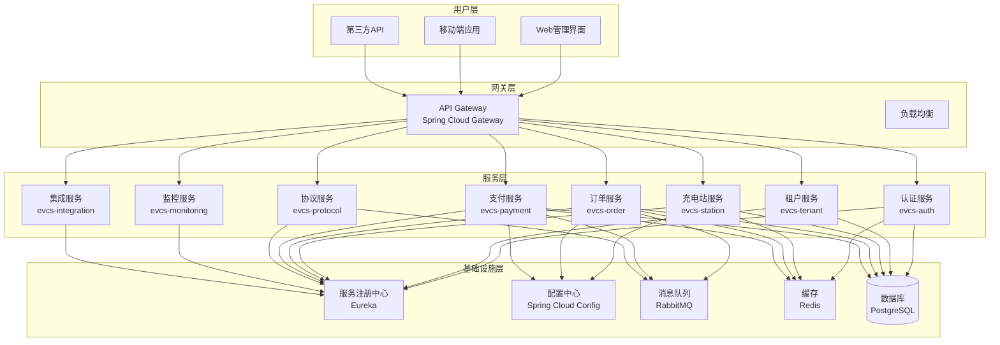
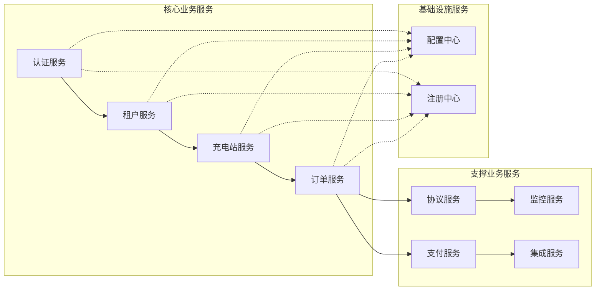
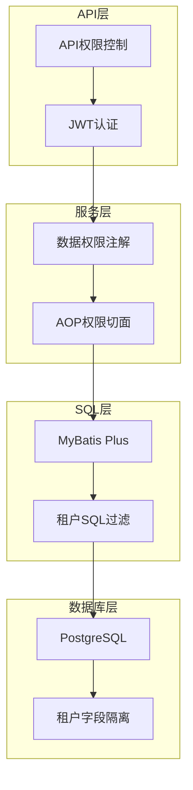

# EVCS Manager 技术架构设计

> **版本**: v2.1 | **最后更新**: 2025-11-10 | **维护者**: 架构团队 | **状态**: 活跃
>
> 🏗️ **用途**: 描述 EVCS 微服务架构、组件依赖与关键技术决策

## 🏗️ 总体架构

### 1.1 架构概览

EVCS Manager 采用现代化的微服务架构设计，基于 Spring Boot 3.2 + Spring Cloud 2023 技术栈，支持高并发、高可用、可扩展的充电站管理平台。



### 1.2 技术栈选择

#### 核心技术栈
| 技术 | 版本 | 用途 | 选择理由 |
|------|------|------|----------|
| Java | 21 | 编程语言 | 现代化特性，性能优秀 |
| Spring Boot | 3.2.2 | 应用框架 | 成熟稳定，生态丰富 |
| Spring Cloud | 2023.0.0 | 微服务框架 | 完整的微服务解决方案 |
| PostgreSQL | 17 | 关系数据库 | 强一致性，支持复杂查询 |
| Redis | 7 | 缓存数据库 | 高性能，支持多种数据结构 |
| RabbitMQ | 3.12 | 消息队列 | 可靠的消息传递 |
| Docker | 28.5+ | 容器化 | 标准化部署 |

#### 辅助技术栈
| 技术 | 版本 | 用途 | 选择理由 |
|------|------|------|----------|
| MyBatis Plus | 3.5.7 | ORM框架 | 简化数据库操作 |
| HikariCP | 5.0 | 连接池 | 高性能数据库连接池 |
| JWT | 4.4.0 | 身份认证 | 无状态认证 |
| Knife4j | 4.4.0 | API文档 | 增强的Swagger UI |
| Gradle | 8.5 | 构建工具 | 高效的构建系统 |

## 🔧 微服务设计

### 2.1 服务拆分原则

#### 按业务领域拆分
- **认证领域**: 用户认证、权限管理
- **租户领域**: 多租户管理、数据隔离
- **充电站领域**: 充电站、充电桩管理
- **订单领域**: 充电订单、计费管理
- **支付领域**: 支付集成、资金管理
- **协议领域**: 设备通信、协议处理
- **监控领域**: 系统监控、告警管理
- **集成领域**: 第三方系统集成

#### 服务职责边界


### 2.2 服务间通信

#### 同步通信
- **HTTP/REST**: 标准的HTTP API调用
- **Feign Client**: Spring Cloud声明式HTTP客户端
- **负载均衡**: Spring Cloud LoadBalancer

#### 异步通信
- **消息队列**: RabbitMQ实现事件驱动
- **事件发布**: ApplicationEventPublisher
- **消息消费**: @RabbitListener注解

```java
// 示例：订单完成事件发布
@EventListener
public void handleOrderCompleted(OrderCompletedEvent event) {
    // 发送消息到支付服务
    rabbitTemplate.convertAndSend("order.events", "order.completed", event);
}

// 示例：消息消费
@RabbitListener(queues = "payment.events")
public void handlePaymentEvent(PaymentEvent event) {
    // 处理支付事件
    paymentService.handlePaymentCallback(event);
}
```

## 🔒 多租户架构

### 3.1 四层数据隔离机制



#### 第一层：数据库层隔离
```sql
-- 所有业务表包含租户字段
CREATE TABLE charging_station (
    station_id BIGSERIAL PRIMARY KEY,
    tenant_id BIGINT NOT NULL,  -- 租户隔离字段
    station_code VARCHAR(64) NOT NULL,
    station_name VARCHAR(100) NOT NULL,
    -- 其他业务字段...
    FOREIGN KEY (tenant_id) REFERENCES sys_tenant(tenant_id)
);

-- 租户字段索引
CREATE INDEX idx_station_tenant ON charging_station(tenant_id, deleted);
```

#### 第二层：SQL层自动过滤
```java
@Configuration
public class MybatisPlusConfig {

    @Bean
    public MybatisPlusInterceptor mybatisPlusInterceptor() {
        MybatisPlusInterceptor interceptor = new MybatisPlusInterceptor();

        // 多租户插件
        TenantLineInnerInterceptor tenantInterceptor = new TenantLineInnerInterceptor();
        tenantInterceptor.setTenantLineHandler(new CustomTenantLineHandler());
        interceptor.addInnerInterceptor(tenantInterceptor);

        return interceptor;
    }
}

public class CustomTenantLineHandler implements TenantLineHandler {

    @Override
    public Expression getTenantId() {
        Long tenantId = TenantContext.getTenantId();
        if (tenantId == null) {
            throw new TenantContextMissingException("租户上下文缺失");
        }
        return new LongValue(tenantId);
    }

    @Override
    public String getTenantIdColumn() {
        return "tenant_id";
    }
}
```

#### 第三层：服务层权限控制
```java
@Aspect
@Component
public class DataScopeAspect {

    @Around("@annotation(dataScope)")
    public Object around(ProceedingJoinPoint joinPoint, DataScope dataScope) throws Throwable {
        // 设置租户上下文
        Long tenantId = getCurrentTenantId();
        TenantContext.setTenantId(tenantId);

        try {
            return joinPoint.proceed();
        } finally {
            TenantContext.clear();
        }
    }
}

// 使用示例
@DataScope(value = DataScope.DataScopeType.TENANT_HIERARCHY)
public List<Station> getStations() {
    // 自动应用租户权限过滤
    return stationService.list();
}
```

#### 第四层：API层访问控制
```java
@RestController
@RequestMapping("/station")
@PreAuthorize("@simplePermissionEvaluator.hasPermission(authentication, null, 'station:list')")
public class StationController {

    @GetMapping("/page")
    public Result<IPage<Station>> getStationPage(
            @RequestParam(defaultValue = "1") Long current,
            @RequestParam(defaultValue = "10") Long size) {
        // API层权限验证
        return Result.success(stationService.getStationPage(current, size));
    }
}
```

### 3.2 租户上下文管理

#### 线程安全的上下文
```java
public class TenantContext {
    private static final ThreadLocal<Long> TENANT_ID = new ThreadLocal<>();
    private static final ThreadLocal<Long> USER_ID = new ThreadLocal<>();
    private static final ThreadLocal<Integer> TENANT_TYPE = new ThreadLocal<>();
    private static final ThreadLocal<String> TENANT_ANCESTORS = new ThreadLocal<>();

    public static Long getCurrentTenantId() {
        return TENANT_ID.get();
    }

    public static void setTenantId(Long tenantId) {
        TENANT_ID.set(tenantId);
    }

    public static void clear() {
        TENANT_ID.remove();
        USER_ID.remove();
        TENANT_TYPE.remove();
        TENANT_ANCESTORS.remove();
    }

    public static boolean hasAccessToTenant(Long targetTenantId) {
        // 系统管理员可以访问所有租户
        if (isSystemAdmin()) {
            return true;
        }

        // 访问自己的数据
        if (getCurrentTenantId().equals(targetTenantId)) {
            return true;
        }

        // 检查是否为上级租户
        String ancestors = getTenantAncestors();
        return ancestors != null && ancestors.contains("," + targetTenantId + ",");
    }
}
```

## 🗄️ 数据架构设计

### 4.1 数据库设计

#### 数据库分片策略
- **按租户分片**: 不同租户数据物理隔离
- **按业务分片**: 不同业务模块使用独立数据库
- **读写分离**: 主库写入，从库查询

#### 核心表结构设计

##### 用户认证表
```sql
-- 租户表
CREATE TABLE sys_tenant (
    tenant_id BIGSERIAL PRIMARY KEY,
    tenant_code VARCHAR(32) NOT NULL UNIQUE,
    tenant_name VARCHAR(100) NOT NULL,
    parent_id BIGINT,
    tenant_type INTEGER NOT NULL DEFAULT 3, -- 1:平台方 2:运营商 3:合作伙伴
    contact_name VARCHAR(50),
    contact_phone VARCHAR(20),
    contact_email VARCHAR(100),
    status INTEGER NOT NULL DEFAULT 1, -- 1:启用 0:禁用
    ancestors VARCHAR(500), -- 祖级路径,如: ,100,101,
    create_by BIGINT,
    create_time TIMESTAMP DEFAULT CURRENT_TIMESTAMP,
    update_by BIGINT,
    update_time TIMESTAMP DEFAULT CURRENT_TIMESTAMP,
    deleted INTEGER DEFAULT 0
);

-- 用户表
CREATE TABLE sys_user (
    user_id BIGSERIAL PRIMARY KEY,
    tenant_id BIGINT NOT NULL,
    username VARCHAR(50) NOT NULL,
    password VARCHAR(255) NOT NULL,
    real_name VARCHAR(50),
    email VARCHAR(100),
    phone VARCHAR(20),
    status INTEGER NOT NULL DEFAULT 1,
    create_by BIGINT,
    create_time TIMESTAMP DEFAULT CURRENT_TIMESTAMP,
    update_by BIGINT,
    update_time TIMESTAMP DEFAULT CURRENT_TIMESTAMP,
    deleted INTEGER DEFAULT 0,
    FOREIGN KEY (tenant_id) REFERENCES sys_tenant(tenant_id)
);
```

##### 充电站管理表
```sql
-- 充电站表
CREATE TABLE charging_station (
    station_id BIGSERIAL PRIMARY KEY,
    tenant_id BIGINT NOT NULL,
    station_code VARCHAR(64) NOT NULL,
    station_name VARCHAR(100) NOT NULL,
    address VARCHAR(200),
    province VARCHAR(50),
    city VARCHAR(50),
    district VARCHAR(50),
    latitude DECIMAL(10, 8),
    longitude DECIMAL(11, 8),
    operator_name VARCHAR(100),
    service_phone VARCHAR(20),
    construction_type INTEGER, -- 建设类型 1:公共 2:专用 3:私人
    station_type INTEGER, -- 站点类型 1:直流站 2:交流站 3:交直流一体站
    status INTEGER NOT NULL DEFAULT 1, -- 1:启用 0:停用
    create_by BIGINT,
    create_time TIMESTAMP DEFAULT CURRENT_TIMESTAMP,
    update_by BIGINT,
    update_time TIMESTAMP DEFAULT CURRENT_TIMESTAMP,
    deleted INTEGER DEFAULT 0,
    FOREIGN KEY (tenant_id) REFERENCES sys_tenant(tenant_id),
    UNIQUE KEY uk_tenant_code (tenant_id, station_code)
);

-- 充电桩表
CREATE TABLE charger (
    charger_id BIGSERIAL PRIMARY KEY,
    tenant_id BIGINT NOT NULL,
    station_id BIGINT NOT NULL,
    charger_code VARCHAR(64) NOT NULL,
    charger_name VARCHAR(100),
    manufacturer VARCHAR(100),
    model VARCHAR(100),
    charger_type INTEGER NOT NULL, -- 1:直流 2:交流 3:交直流一体
    power_rate DECIMAL(8, 2), -- 额定功率
    voltage_level INTEGER, -- 电压等级
    protocol_type VARCHAR(20), -- 协议类型
    status INTEGER NOT NULL DEFAULT 1, -- 0:离线 1:空闲 2:充电中 3:故障
    create_by BIGINT,
    create_time TIMESTAMP DEFAULT CURRENT_TIMESTAMP,
    update_by BIGINT,
    update_time TIMESTAMP DEFAULT CURRENT_TIMESTAMP,
    deleted INTEGER DEFAULT 0,
    FOREIGN KEY (tenant_id) REFERENCES sys_tenant(tenant_id),
    FOREIGN KEY (station_id) REFERENCES charging_station(station_id),
    UNIQUE KEY uk_tenant_code (tenant_id, charger_code)
);
```

##### 订单管理表
```sql
-- 充电订单表
CREATE TABLE charging_order (
    order_id BIGSERIAL PRIMARY KEY,
    tenant_id BIGINT NOT NULL,
    order_no VARCHAR(64) NOT NULL UNIQUE,
    user_id BIGINT NOT NULL,
    station_id BIGINT NOT NULL,
    charger_id BIGINT NOT NULL,
    session_id VARCHAR(64), -- 充电会话ID
    billing_plan_id BIGINT,

    -- 时间信息
    start_time TIMESTAMP, -- 开始充电时间
    end_time TIMESTAMP, -- 结束充电时间

    -- 电量信息
    start_energy DECIMAL(10, 2), -- 开始电表读数
    end_energy DECIMAL(10, 2), -- 结束电表读数
    total_energy DECIMAL(10, 2), -- 总充电量

    -- 金额信息
    energy_amount DECIMAL(10, 2), -- 电费金额
    service_amount DECIMAL(10, 2), -- 服务费金额
    total_amount DECIMAL(10, 2), -- 总金额

    status INTEGER NOT NULL DEFAULT 1, -- 订单状态
    create_by BIGINT,
    create_time TIMESTAMP DEFAULT CURRENT_TIMESTAMP,
    update_by BIGINT,
    update_time TIMESTAMP DEFAULT CURRENT_TIMESTAMP,
    deleted INTEGER DEFAULT 0,
    FOREIGN KEY (tenant_id) REFERENCES sys_tenant(tenant_id)
);
```

### 4.2 缓存架构

#### Redis缓存设计
```java
@Service
public class CacheServiceImpl implements ICacheService {

    private final RedisTemplate<String, Object> redisTemplate;

    // 租户信息缓存
    @Override
    public void cacheTenant(Tenant tenant) {
        String key = "tenant:" + tenant.getTenantId();
        redisTemplate.opsForValue().set(key, tenant, 24, TimeUnit.HOURS);
    }

    // 用户信息缓存
    @Override
    public void cacheUser(User user) {
        String key = "user:" + user.getUserId();
        redisTemplate.opsForValue().set(key, user, 2, TimeUnit.HOURS);
    }

    // 计费方案缓存
    @Override
    public void cacheBillingPlan(BillingPlan plan) {
        String key = "billing:plan:" + plan.getPlanId();
        redisTemplate.opsForValue().set(key, plan, 1, TimeUnit.HOURS);
    }
}
```

#### 缓存策略
- **热点数据**: 租户信息、用户信息、计费方案
- **缓存时间**: 根据数据更新频率设置不同TTL
- **缓存更新**: 数据变更时主动更新缓存
- **缓存预热**: 系统启动时预加载热点数据

## 🔌 协议架构

### 5.1 支持的协议

#### OCPP 1.6协议
```java
@Component
public class OcppProtocolHandler implements ProtocolHandler {

    @Override
    public String getProtocolType() {
        return "OCPP";
    }

    @Override
    public void handleChargingStart(ChargingStartRequest request) {
        // 处理OCPP开始充电请求
        ChargingStartEvent event = ChargingStartEvent.builder()
            .chargerId(request.getChargerId())
            .sessionId(request.getSessionId())
            .protocolType("OCPP")
            .build();

        eventPublisher.publishEvent(event);
    }

    @Override
    public void handleChargingStop(ChargingStopRequest request) {
        // 处理OCPP停止充电请求
    }
}
```

#### 云快充协议
```java
@Component
public class CloudProtocolHandler implements ProtocolHandler {

    @Override
    public String getProtocolType() {
        return "CLOUD";
    }

    @Override
    public void handleChargingStart(ChargingStartRequest request) {
        // 处理云快充开始充电请求
    }
}
```

### 5.2 协议事件模型

```java
@Data
@Builder
public class ChargingStartEvent {
    private Long chargerId;
    private Long tenantId;
    private String protocolType;
    private String sessionId;
    private Long userId;
    private String orderNo;
    private Double initialEnergy;
    private Boolean success;
    private String message;
    private LocalDateTime timestamp;
}
```

## 🛡️ 安全架构

### 6.1 认证授权

#### JWT认证
```java
@Component
public class JwtUtil {

    @Value("${jwt.secret}")
    private String secret;

    @Value("${jwt.expire}")
    private Integer expire;

    public String generateToken(User user) {
        Map<String, Object> claims = new HashMap<>();
        claims.put("userId", user.getUserId());
        claims.put("tenantId", user.getTenantId());
        claims.put("username", user.getUsername());
        claims.put("tenantType", user.getTenantType());

        return Jwts.builder()
            .setClaims(claims)
            .setSubject(user.getUsername())
            .setIssuedAt(new Date())
            .setExpiration(new Date(System.currentTimeMillis() + expire * 1000))
            .signWith(SignatureAlgorithm.HS512, secret)
            .compact();
    }

    public boolean verifyToken(String token) {
        try {
            Jwts.parser().setSigningKey(secret).parseClaimsJws(token);
            return true;
        } catch (Exception e) {
            return false;
        }
    }
}
```

#### 权限控制
```java
@Component
public class SimplePermissionEvaluator {

    public boolean hasPermission(Authentication authentication,
                               Object targetId, String permission) {

        User user = (User) authentication.getPrincipal();

        // 检查用户状态
        if (user.getStatus() != 1) {
            return false;
        }

        // 检查租户状态
        Tenant tenant = tenantService.getById(user.getTenantId());
        if (tenant == null || tenant.getStatus() != 1) {
            return false;
        }

        // 检查具体权限
        return checkUserPermission(user.getUserId(), permission);
    }
}
```

### 6.2 数据安全

#### 数据加密
```java
@Component
public class DataEncryption {

    private final AESUtil aesUtil;

    @EventListener
    public void handleUserCreate(UserCreateEvent event) {
        // 敏感信息加密存储
        String encryptedPhone = aesUtil.encrypt(event.getPhone());
        String encryptedEmail = aesUtil.encrypt(event.getEmail());

        userMapper.insertUserWithEncryptedData(event.getUser(), encryptedPhone, encryptedEmail);
    }
}
```

#### SQL注入防护
```java
@RestController
@RequestMapping("/station")
public class StationController {

    @GetMapping("/search")
    public Result<List<Station>> searchStations(
            @RequestParam String keyword) {

        // 使用参数化查询防止SQL注入
        QueryWrapper<Station> wrapper = new QueryWrapper<>();
        wrapper.like("station_name", keyword)
               .or()
               .like("address", keyword);

        return Result.success(stationService.list(wrapper));
    }
}
```

## 📊 监控架构

### 7.1 系统监控

#### Spring Boot Actuator
```yaml
management:
  endpoints:
    web:
      exposure:
        include: health,info,prometheus,metrics
  endpoint:
    health:
      show-details: always
  metrics:
    export:
      prometheus:
        enabled: true
```

#### 自定义监控指标
```java
@Component
public class BusinessMetrics {

    private final Counter orderCreatedCounter;
    private final Counter paymentSuccessCounter;
    private final Timer orderProcessingTimer;

    public BusinessMetrics(MeterRegistry meterRegistry) {
        this.orderCreatedCounter = Counter.builder("order.created")
            .description("Total number of orders created")
            .register(meterRegistry);

        this.paymentSuccessCounter = Counter.builder("payment.success")
            .description("Total number of successful payments")
            .register(meterRegistry);

        this.orderProcessingTimer = Timer.builder("order.processing.time")
            .description("Order processing time")
            .register(meterRegistry);
    }

    @EventListener
    public void handleOrderCreated(OrderCreatedEvent event) {
        orderCreatedCounter.increment();
    }

    @EventListener
    public void handlePaymentSuccess(PaymentSuccessEvent event) {
        paymentSuccessCounter.increment();
    }
}
```

### 7.2 日志架构

#### 结构化日志
```xml
<!-- logback-spring.xml -->
<configuration>
    <appender name="STDOUT" class="ch.qos.logback.core.ConsoleAppender">
        <encoder class="net.logstash.logback.encoder.LoggingEventCompositeJsonEncoder">
            <providers>
                <timestamp/>
                <logLevel/>
                <loggerName/>
                <message/>
                <mdc/>
                <arguments/>
                <stackTrace/>
            </providers>
        </encoder>
    </appender>

    <root level="INFO">
        <appender-ref ref="STDOUT"/>
    </root>
</configuration>
```

#### 日志追踪
```java
@Component
public class LogInterceptor implements HandlerInterceptor {

    @Override
    public boolean preHandle(HttpServletRequest request, HttpServletResponse response,
                           Object handler) throws Exception {

        String traceId = UUID.randomUUID().toString().replace("-", "");
        MDC.put("traceId", traceId);
        MDC.put("userId", getCurrentUserId());
        MDC.put("tenantId", getCurrentTenantId());

        return true;
    }

    @Override
    public void afterCompletion(HttpServletRequest request, HttpServletResponse response,
                              Object handler, Exception ex) throws Exception {
        MDC.clear();
    }
}
```

## 🚀 部署架构

### 8.1 容器化部署

#### Dockerfile设计
```dockerfile
# 基础镜像
FROM openjdk:21-jre-slim

# 设置时区
ENV TZ=Asia/Shanghai
RUN ln -snf /usr/share/zoneinfo/$TZ /etc/localtime && echo $TZ > /etc/timezone

# 创建应用目录
WORKDIR /app

# 复制应用文件
COPY build/libs/*.jar app.jar

# 设置JVM参数
ENV JAVA_OPTS="-Xms512m -Xmx512m -XX:+UseG1GC -XX:MaxGCPauseMillis=100"

# 健康检查
HEALTHCHECK --interval=30s --timeout=10s --start-period=90s --retries=3 \
  CMD curl -f http://localhost:8080/actuator/health || exit 1

# 启动应用
ENTRYPOINT ["sh", "-c", "java $JAVA_OPTS -jar app.jar"]
```

#### Docker Compose编排
```yaml
version: '3.8'

services:
  postgres:
    image: postgres:17-alpine
    environment:
      POSTGRES_DB: evcs_mgr
      POSTGRES_USER: postgres
      POSTGRES_PASSWORD: postgres
    volumes:
      - postgres_data:/var/lib/postgresql/data
    healthcheck:
      test: ["CMD-SHELL", "pg_isready -U postgres"]
      interval: 10s
      timeout: 5s
      retries: 5

  redis:
    image: redis:7-alpine
    command: redis-server --appendonly yes
    volumes:
      - redis_data:/data
    healthcheck:
      test: ["CMD", "redis-cli", "ping"]
      interval: 10s
      timeout: 3s
      retries: 5

  rabbitmq:
    image: rabbitmq:3-management-alpine
    environment:
      RABBITMQ_DEFAULT_USER: guest
      RABBITMQ_DEFAULT_PASS: guest
    volumes:
      - rabbitmq_data:/var/lib/rabbitmq
    healthcheck:
      test: ["CMD", "rabbitmq-diagnostics", "ping"]
      interval: 10s
      timeout: 5s
      retries: 5

  eureka:
    build: ./evcs-eureka
    ports:
      - "8761:8761"
    environment:
      JAVA_OPTS: "-Xms256m -Xmx512m"
    depends_on:
      postgres:
        condition: service_healthy

  gateway:
    build: ./evcs-gateway
    ports:
      - "8080:8080"
    environment:
      EUREKA_CLIENT_SERVICE_URL_DEFAULTZONE: "http://eureka:8761/eureka"
    depends_on:
      eureka:
        condition: service_healthy

volumes:
  postgres_data:
  redis_data:
  rabbitmq_data:
```

### 8.2 高可用部署

#### 负载均衡
```yaml
# nginx.conf
upstream gateway {
    server gateway1:8080;
    server gateway2:8080;
    server gateway3:8080;
}

server {
    listen 80;
    location / {
        proxy_pass http://gateway;
        proxy_set_header Host $host;
        proxy_set_header X-Real-IP $remote_addr;
        proxy_set_header X-Forwarded-For $proxy_add_x_forwarded_for;
    }
}
```

#### 数据库主从复制
```yaml
# docker-compose.replication.yml
services:
  postgres-master:
    image: postgres:17-alpine
    environment:
      POSTGRES_REPLICATION_USER: replicator
      POSTGRES_REPLICATION_PASSWORD: replicator_password
    command: >
      postgres
      -c wal_level=replica
      -c max_wal_senders=10
      -c max_replication_slots=10

  postgres-slave:
    image: postgres:17-alpine
    environment:
      PGUSER: postgres
      POSTGRES_MASTER_SERVICE: postgres-master
      POSTGRES_REPLICATION_USER: replicator
      POSTGRES_REPLICATION_PASSWORD: replicator_password
```

## 🎯 性能优化

### 9.1 JVM调优

#### G1GC配置
```bash
# 生产环境JVM参数
JAVA_OPTS="
-Xms512m -Xmx512m
-XX:+UseG1GC
-XX:MaxGCPauseMillis=100
-XX:ParallelGCThreads=4
-XX:ConcGCThreads=2
-XX:InitiatingHeapOccupancyPercent=45
-XX:+ParallelRefProcEnabled
-XX:+UseStringDeduplication
-XX:+UnlockExperimentalVMOptions
-XX:+UseCGroupMemoryLimitForHeap
"
```

#### JVM监控
```bash
# JFR诊断记录
-XX:StartFlightRecording=dumponexit=true,filename=/tmp/flight.jfr
-XX:FlightRecorderOptions=stackdepth=128
```

### 9.2 数据库优化

#### 索引优化
```sql
-- 复合索引
CREATE INDEX idx_station_tenant_status ON charging_station(tenant_id, status);
CREATE INDEX idx_order_tenant_status ON charging_order(tenant_id, status);
CREATE INDEX idx_payment_tenant_status ON payment_order(tenant_id, status);

-- 部分索引
CREATE INDEX idx_active_chargers ON charger(tenant_id, status) WHERE status = 1;
```

#### 连接池优化
```yaml
spring:
  datasource:
    hikari:
      maximum-pool-size: 30
      minimum-idle: 10
      connection-timeout: 20000
      idle-timeout: 300000
      max-lifetime: 1200000
      leak-detection-threshold: 60000
```

### 9.3 缓存优化

#### Redis集群
```yaml
spring:
  redis:
    cluster:
      nodes:
        - redis1:6379
        - redis2:6379
        - redis3:6379
    lettuce:
      pool:
        max-active: 50
        max-idle: 20
        min-idle: 5
```

#### 缓存预热
```java
@Component
public class CachePreloadRunner implements CommandLineRunner {

    @Override
    public void run(String... args) throws Exception {
        // 预加载热点数据
        preloadTenantData();
        preloadBillingPlans();
        preloadChargerData();
    }

    private void preloadBillingPlans() {
        List<Long> hotStationIds = getHotStationIds();
        hotStationIds.forEach(stationId -> {
            List<BillingPlan> plans = billingPlanService.getActivePlans(stationId);
            plans.forEach(plan -> cacheService.cacheBillingPlan(plan));
        });
    }
}
```

## 📈 扩展性设计

### 10.1 水平扩展

#### 服务无状态化
```java
@RestController
public class StationController {

    // 使用ThreadLocal存储上下文信息，实现无状态
    @GetMapping("/list")
    public Result<List<Station>> getStationList() {
        // 从请求头获取租户信息，不依赖会话状态
        Long tenantId = TenantContext.getCurrentTenantId();
        return Result.success(stationService.getStationList(tenantId));
    }
}
```

#### 分布式缓存
```java
@Configuration
public class RedisConfig {

    @Bean
    public RedisTemplate<String, Object> redisTemplate(RedisConnectionFactory factory) {
        RedisTemplate<String, Object> template = new RedisTemplate<>();
        template.setConnectionFactory(factory);

        // 使用JSON序列化
        Jackson2JsonRedisSerializer<Object> serializer = new Jackson2JsonRedisSerializer<>(Object.class);
        template.setDefaultSerializer(serializer);

        return template;
    }
}
```

### 10.2 功能扩展

#### 插件化架构
```java
public interface PaymentPlugin {
    String getPluginName();
    PaymentResponse createPayment(PaymentRequest request);
    PaymentResponse queryPayment(String tradeNo);
    RefundResponse refund(RefundRequest request);
}

@Component
public class AlipayPlugin implements PaymentPlugin {

    @Override
    public String getPluginName() {
        return "alipay";
    }

    @Override
    public PaymentResponse createPayment(PaymentRequest request) {
        // 支付宝支付逻辑
        return alipayService.createPayment(request);
    }
}
```

#### 配置化管理
```java
@ConfigurationProperties(prefix = "evcs.payment")
@Data
public class PaymentProperties {

    private AlipayConfig alipay = new AlipayConfig();
    private WechatConfig wechat = new WechatConfig();

    @Data
    public static class AlipayConfig {
        private String appId;
        private String privateKey;
        private String publicKey;
        private String gateway;
        private boolean enabled = true;
    }
}
```

## 🔧 技术债务管理

### 11.1 当前技术债务

#### 高优先级债务
1. **支付系统不完整** - 仅有模拟实现，缺少真实SDK集成
2. **协议处理薄弱** - OCPP协议支持不完整
3. **测试覆盖率低** - 仅45%，低于80%目标
4. **监控体系缺失** - 缺少完整的监控告警

#### 中等优先级债务
1. **网关功能不完善** - 缺少限流、熔断机制
2. **文档体系混乱** - 180个文档，冗余严重
3. **权限验证不完整** - 部分接口缺少权限检查
4. **日志规范不统一** - 日志格式和级别需要标准化

#### 低优先级债务
1. **代码重复** - 部分实体类和工具类存在重复
2. **配置管理** - 配置分散，需要统一管理
3. **异常处理** - 异常处理机制需要完善
4. **国际化支持** - 缺少多语言支持

### 11.2 债务偿还计划

#### 短期计划 (1-2个月)
1. **修复支付系统** - 集成支付宝/微信SDK
2. **提升测试质量** - 重构测试用例，提高覆盖率
3. **完善权限验证** - 为所有接口添加权限检查

#### 中期计划 (3-6个月)
1. **完善协议处理** - 实现OCPP 1.6完整协议
2. **建立监控体系** - 集成Prometheus + Grafana
3. **增强网关功能** - 添加限流、熔断、日志收集

#### 长期计划 (6-12个月)
1. **架构优化** - 微服务治理优化
2. **性能提升** - 全面性能优化
3. **安全加固** - 安全机制完善

---

**相关文档**:
- [产品需求文档](./requirements.md)
- [API接口设计](./api-design.md)
- [数据模型设计](./data-model.md)
- [开发计划](../archive/planning-docs/)
