# EVCS Manager 数据模型设计

> **版本**: v2.1 | **最后更新**: 2025-11-10 | **维护者**: 数据架构师 | **状态**: 活跃
>
> 🗄️ **用途**: 描述核心业务表结构、约束与多租户策略

## 📋 概述

本文档定义了 EVCS Manager 充电站管理平台的完整数据模型设计，包括数据库表结构、实体关系、数据约束等。

### 🎯 设计目标
- **多租户支持**: 支持租户数据完全隔离
- **数据一致性**: 确保数据的完整性和一致性
- **性能优化**: 合理的索引设计，优化查询性能
- **扩展性**: 支持业务功能扩展
- **数据安全**: 敏感数据加密存储

## 🗄️ 数据库设计

### 设计原则
1. **所有业务表包含租户字段**: `tenant_id`
2. **统一的主键策略**: 使用自增主键
3. **软删除机制**: 使用 `deleted` 字段标记删除状态
4. **审计字段**: 包含创建人、创建时间、更新人、更新时间
5. **命名规范**: 使用小写字母和下划线

### 核心表设计

#### 1. 租户管理

##### 租户表 (sys_tenant)
```sql
CREATE TABLE sys_tenant (
    tenant_id BIGSERIAL PRIMARY KEY,
    tenant_code VARCHAR(32) NOT NULL UNIQUE,
    tenant_name VARCHAR(100) NOT NULL,
    parent_id BIGINT,
    tenant_type INTEGER NOT NULL DEFAULT 3 COMMENT '租户类型：1-平台方，2-运营商，3-合作伙伴',
    contact_name VARCHAR(50) COMMENT '联系人姓名',
    contact_phone VARCHAR(20) COMMENT '联系电话',
    contact_email VARCHAR(100) COMMENT '联系邮箱',
    status INTEGER NOT NULL DEFAULT 1 COMMENT '状态：1-启用，0-禁用',
    ancestors VARCHAR(500) COMMENT '祖级路径，如：,100,101,',
    level INTEGER NOT NULL DEFAULT 1 COMMENT '层级深度',
    sort_order INTEGER DEFAULT 0 COMMENT '排序',
    remark TEXT COMMENT '备注',
    create_by BIGINT,
    create_time TIMESTAMP DEFAULT CURRENT_TIMESTAMP,
    update_by BIGINT,
    update_time TIMESTAMP DEFAULT CURRENT_TIMESTAMP,
    deleted INTEGER DEFAULT 0 COMMENT '删除标识：0-正常，1-删除',

    CONSTRAINT uk_tenant_code UNIQUE (tenant_code),
    CONSTRAINT fk_tenant_parent FOREIGN KEY (parent_id) REFERENCES sys_tenant(tenant_id)
);

-- 索引
CREATE INDEX idx_tenant_parent_id ON sys_tenant(parent_id, deleted);
CREATE INDEX idx_tenant_type_status ON sys_tenant(tenant_type, status, deleted);
CREATE INDEX idx_tenant_code ON sys_tenant(tenant_code, deleted);
```

##### 用户表 (sys_user)
```sql
CREATE TABLE sys_user (
    user_id BIGSERIAL PRIMARY KEY,
    tenant_id BIGINT NOT NULL,
    username VARCHAR(50) NOT NULL,
    password VARCHAR(255) NOT NULL COMMENT 'BCrypt加密',
    real_name VARCHAR(50) COMMENT '真实姓名',
    email VARCHAR(100) COMMENT '邮箱',
    phone VARCHAR(20) COMMENT '手机号',
    avatar VARCHAR(255) COMMENT '头像URL',
    status INTEGER NOT NULL DEFAULT 1 COMMENT '状态：1-正常，0-禁用',
    last_login_time TIMESTAMP COMMENT '最后登录时间',
    last_login_ip VARCHAR(50) COMMENT '最后登录IP',
    create_by BIGINT,
    create_time TIMESTAMP DEFAULT CURRENT_TIMESTAMP,
    update_by BIGINT,
    update_time TIMESTAMP DEFAULT CURRENT_TIMESTAMP,
    deleted INTEGER DEFAULT 0,

    CONSTRAINT uk_user_tenant_username UNIQUE (tenant_id, username),
    CONSTRAINT fk_user_tenant FOREIGN KEY (tenant_id) REFERENCES sys_tenant(tenant_id)
);

-- 索引
CREATE INDEX idx_user_tenant_id ON sys_user(tenant_id, deleted);
CREATE INDEX idx_user_username ON sys_user(username, deleted);
CREATE INDEX idx_user_email ON sys_user(email, deleted);
CREATE INDEX idx_user_phone ON sys_user(phone, deleted);
```

##### 角色表 (sys_role)
```sql
CREATE TABLE sys_role (
    role_id BIGSERIAL PRIMARY KEY,
    tenant_id BIGINT NOT NULL,
    role_code VARCHAR(50) NOT NULL,
    role_name VARCHAR(100) NOT NULL,
    description VARCHAR(255) COMMENT '角色描述',
    status INTEGER NOT NULL DEFAULT 1,
    create_by BIGINT,
    create_time TIMESTAMP DEFAULT CURRENT_TIMESTAMP,
    update_by BIGINT,
    update_time TIMESTAMP DEFAULT CURRENT_TIMESTAMP,
    deleted INTEGER DEFAULT 0,

    CONSTRAINT uk_role_tenant_code UNIQUE (tenant_id, role_code),
    CONSTRAINT fk_role_tenant FOREIGN KEY (tenant_id) REFERENCES sys_tenant(tenant_id)
);

-- 索引
CREATE INDEX idx_role_tenant_id ON sys_role(tenant_id, deleted);
CREATE INDEX idx_role_code ON sys_role(role_code, deleted);
```

##### 用户角色关联表 (sys_user_role)
```sql
CREATE TABLE sys_user_role (
    id BIGSERIAL PRIMARY KEY,
    user_id BIGINT NOT NULL,
    role_id BIGINT NOT NULL,
    create_time TIMESTAMP DEFAULT CURRENT_TIMESTAMP,

    CONSTRAINT uk_user_role UNIQUE (user_id, role_id),
    CONSTRAINT fk_ur_user FOREIGN KEY (user_id) REFERENCES sys_user(user_id),
    CONSTRAINT fk_ur_role FOREIGN KEY (role_id) REFERENCES sys_role(role_id)
);

-- 索引
CREATE INDEX idx_user_role_user_id ON sys_user_role(user_id);
CREATE INDEX idx_user_role_role_id ON sys_user_role(role_id);
```

#### 2. 充电站管理

##### 充电站表 (charging_station)
```sql
CREATE TABLE charging_station (
    station_id BIGSERIAL PRIMARY KEY,
    tenant_id BIGINT NOT NULL,
    station_code VARCHAR(64) NOT NULL,
    station_name VARCHAR(100) NOT NULL,
    address VARCHAR(200) COMMENT '详细地址',
    province VARCHAR(50) COMMENT '省份',
    city VARCHAR(50) COMMENT '城市',
    district VARCHAR(50) COMMENT '区县',
    latitude DECIMAL(10, 8) COMMENT '纬度',
    longitude DECIMAL(11, 8) COMMENT '经度',
    operator_name VARCHAR(100) COMMENT '运营商名称',
    service_phone VARCHAR(20) COMMENT '服务电话',
    construction_type INTEGER COMMENT '建设类型：1-公共，2-专用，3-私人',
    station_type INTEGER COMMENT '站点类型：1-直流站，2-交流站，3-交直流一体站',
    park_count INTEGER DEFAULT 0 COMMENT '停车位数量',
    station_pic VARCHAR(500) COMMENT '站点图片',
    equipment_info TEXT COMMENT '设备信息',
    status INTEGER NOT NULL DEFAULT 1 COMMENT '状态：1-启用，0-停用',
    create_by BIGINT,
    create_time TIMESTAMP DEFAULT CURRENT_TIMESTAMP,
    update_by BIGINT,
    update_time TIMESTAMP DEFAULT CURRENT_TIMESTAMP,
    deleted INTEGER DEFAULT 0,

    CONSTRAINT uk_station_tenant_code UNIQUE (tenant_id, station_code),
    CONSTRAINT fk_station_tenant FOREIGN KEY (tenant_id) REFERENCES sys_tenant(tenant_id)
);

-- 索引
CREATE INDEX idx_station_tenant_id ON charging_station(tenant_id, deleted);
CREATE INDEX idx_station_code ON charging_station(station_code, deleted);
CREATE INDEX idx_station_status ON charging_station(status, deleted);
CREATE INDEX idx_station_location ON charging_station(latitude, longitude, deleted);
CREATE INDEX idx_station_city ON charging_station(city, deleted);
```

##### 充电桩表 (charger)
```sql
CREATE TABLE charger (
    charger_id BIGSERIAL PRIMARY KEY,
    tenant_id BIGINT NOT NULL,
    station_id BIGINT NOT NULL,
    charger_code VARCHAR(64) NOT NULL,
    charger_name VARCHAR(100) COMMENT '充电桩名称',
    manufacturer VARCHAR(100) COMMENT '设备厂商',
    model VARCHAR(100) COMMENT '设备型号',
    charger_type INTEGER NOT NULL COMMENT '充电桩类型：1-直流，2-交流，3-交直流一体',
    power_rate DECIMAL(8, 2) COMMENT '额定功率(kW)',
    voltage_level INTEGER COMMENT '电压等级(V)',
    current_rate DECIMAL(8, 2) COMMENT '额定电流(A)',
    protocol_type VARCHAR(20) DEFAULT 'OCPP' COMMENT '协议类型',
    firmware_version VARCHAR(50) COMMENT '固件版本',
    install_date DATE COMMENT '安装日期',
    last_maintenance_date DATE COMMENT '最后维护日期',
    status INTEGER NOT NULL DEFAULT 1 COMMENT '状态：0-离线，1-空闲，2-充电中，3-故障',
    create_by BIGINT,
    create_time TIMESTAMP DEFAULT CURRENT_TIMESTAMP,
    update_by BIGINT,
    update_time TIMESTAMP DEFAULT CURRENT_TIMESTAMP,
    deleted INTEGER DEFAULT 0,

    CONSTRAINT uk_charger_tenant_code UNIQUE (tenant_id, charger_code),
    CONSTRAINT uk_charger_station_code UNIQUE (station_id, charger_code),
    CONSTRAINT fk_charger_tenant FOREIGN KEY (tenant_id) REFERENCES sys_tenant(tenant_id),
    CONSTRAINT fk_charger_station FOREIGN KEY (station_id) REFERENCES charging_station(station_id)
);

-- 索引
CREATE INDEX idx_charger_tenant_id ON charger(tenant_id, deleted);
CREATE INDEX idx_charger_station_id ON charger(station_id, deleted);
CREATE INDEX idx_charger_code ON charger(charger_code, deleted);
CREATE INDEX idx_charger_status ON charger(status, deleted);
CREATE INDEX idx_charger_type ON charger(charger_type, deleted);
```

#### 3. 订单管理

##### 计费方案表 (billing_plan)
```sql
CREATE TABLE billing_plan (
    plan_id BIGSERIAL PRIMARY KEY,
    tenant_id BIGINT NOT NULL,
    plan_name VARCHAR(100) NOT NULL,
    plan_type INTEGER NOT NULL DEFAULT 1 COMMENT '方案类型：1-标准计费，2-分时计费，3-阶梯计费',
    description VARCHAR(255) COMMENT '方案描述',
    is_default INTEGER DEFAULT 0 COMMENT '是否默认方案：1-是，0-否',
    status INTEGER NOT NULL DEFAULT 1 COMMENT '状态：1-启用，0-禁用',
    effective_time TIMESTAMP COMMENT '生效时间',
    expire_time TIMESTAMP COMMENT '失效时间',
    create_by BIGINT,
    create_time TIMESTAMP DEFAULT CURRENT_TIMESTAMP,
    update_by BIGINT,
    update_time TIMESTAMP DEFAULT CURRENT_TIMESTAMP,
    deleted INTEGER DEFAULT 0,

    CONSTRAINT fk_plan_tenant FOREIGN KEY (tenant_id) REFERENCES sys_tenant(tenant_id)
);

-- 索引
CREATE INDEX idx_plan_tenant_id ON billing_plan(tenant_id, deleted);
CREATE INDEX idx_plan_status ON billing_plan(status, deleted);
CREATE INDEX idx_plan_default ON billing_plan(is_default, deleted);
```

##### 计费方案段表 (billing_plan_segment)
```sql
CREATE TABLE billing_plan_segment (
    segment_id BIGSERIAL PRIMARY KEY,
    plan_id BIGINT NOT NULL,
    segment_name VARCHAR(100) NOT NULL,
    start_time TIME COMMENT '开始时间(分时计费)',
    end_time TIME COMMENT '结束时间(分时计费)',
    min_energy DECIMAL(10, 2) COMMENT '最小电量(kWh，阶梯计费)',
    max_energy DECIMAL(10, 2) COMMENT '最大电量(kWh，阶梯计费)',
    energy_price DECIMAL(8, 4) NOT NULL COMMENT '电费单价(元/kWh)',
    service_price DECIMAL(8, 4) NOT NULL COMMENT '服务费单价(元/kWh)',
    parking_price DECIMAL(8, 4) DEFAULT 0 COMMENT '停车费单价(元/分钟)',
    sort_order INTEGER DEFAULT 0 COMMENT '排序',
    create_time TIMESTAMP DEFAULT CURRENT_TIMESTAMP,

    CONSTRAINT fk_segment_plan FOREIGN KEY (plan_id) REFERENCES billing_plan(plan_id)
);

-- 索引
CREATE INDEX idx_segment_plan_id ON billing_plan_segment(plan_id);
CREATE INDEX idx_segment_sort ON billing_plan_segment(plan_id, sort_order);
```

##### 充电订单表 (charging_order)
```sql
CREATE TABLE charging_order (
    order_id BIGSERIAL PRIMARY KEY,
    tenant_id BIGINT NOT NULL,
    order_no VARCHAR(64) NOT NULL UNIQUE,
    user_id BIGINT NOT NULL,
    station_id BIGINT NOT NULL,
    charger_id BIGINT NOT NULL,
    session_id VARCHAR(64) COMMENT '充电会话ID',
    billing_plan_id BIGINT COMMENT '计费方案ID',

    -- 时间信息
    start_time TIMESTAMP COMMENT '开始充电时间',
    end_time TIMESTAMP COMMENT '结束充电时间',
    duration INTEGER COMMENT '充电时长(秒)',

    -- 电量信息
    start_energy DECIMAL(10, 2) COMMENT '开始电表读数(kWh)',
    end_energy DECIMAL(10, 2) COMMENT '结束电表读数(kWh)',
    total_energy DECIMAL(10, 2) COMMENT '总充电量(kWh)',

    -- 金额信息
    energy_amount DECIMAL(10, 2) DEFAULT 0 COMMENT '电费金额(元)',
    service_amount DECIMAL(10, 2) DEFAULT 0 COMMENT '服务费金额(元)',
    parking_amount DECIMAL(10, 2) DEFAULT 0 COMMENT '停车费金额(元)',
    total_amount DECIMAL(10, 2) DEFAULT 0 COMMENT '总金额(元)',
    discount_amount DECIMAL(10, 2) DEFAULT 0 COMMENT '优惠金额(元)',
    actual_amount DECIMAL(10, 2) DEFAULT 0 COMMENT '实付金额(元)',

    -- 状态信息
    status INTEGER NOT NULL DEFAULT 1 COMMENT '订单状态：1-充电中，2-已完成，3-已取消，4-待支付，5-已支付，6-已退款',
    payment_status INTEGER DEFAULT 0 COMMENT '支付状态：0-未支付，1-支付中，2-已支付，3-退款中，4-已退款',
    remark VARCHAR(255) COMMENT '备注',

    create_by BIGINT,
    create_time TIMESTAMP DEFAULT CURRENT_TIMESTAMP,
    update_by BIGINT,
    update_time TIMESTAMP DEFAULT CURRENT_TIMESTAMP,
    deleted INTEGER DEFAULT 0,

    CONSTRAINT fk_order_tenant FOREIGN KEY (tenant_id) REFERENCES sys_tenant(tenant_id),
    CONSTRAINT fk_order_user FOREIGN KEY (user_id) REFERENCES sys_user(user_id),
    CONSTRAINT fk_order_station FOREIGN KEY (station_id) REFERENCES charging_station(station_id),
    CONSTRAINT fk_order_charger FOREIGN KEY (charger_id) REFERENCES charger(charger_id),
    CONSTRAINT fk_order_plan FOREIGN KEY (billing_plan_id) REFERENCES billing_plan(plan_id)
);

-- 索引
CREATE INDEX idx_order_tenant_id ON charging_order(tenant_id, deleted);
CREATE INDEX idx_order_user_id ON charging_order(user_id, deleted);
CREATE INDEX idx_order_station_id ON charging_order(station_id, deleted);
CREATE INDEX idx_order_charger_id ON charging_order(charger_id, deleted);
CREATE INDEX idx_order_no ON charging_order(order_no, deleted);
CREATE INDEX idx_order_status ON charging_order(status, deleted);
CREATE INDEX idx_order_create_time ON charging_order(create_time, deleted);
CREATE INDEX idx_order_session_id ON charging_order(session_id, deleted);
```

#### 4. 支付管理

##### 支付订单表 (payment_order)
```sql
CREATE TABLE payment_order (
    payment_id BIGSERIAL PRIMARY KEY,
    tenant_id BIGINT NOT NULL,
    order_id BIGINT NOT NULL,
    payment_no VARCHAR(64) NOT NULL UNIQUE,
    third_party_trade_no VARCHAR(64) COMMENT '第三方交易号',
    payment_method VARCHAR(20) NOT NULL COMMENT '支付方式：alipay,wechat,unionpay',
    payment_channel VARCHAR(50) COMMENT '支付渠道',
    amount DECIMAL(10, 2) NOT NULL COMMENT '支付金额(元)',
    currency VARCHAR(3) DEFAULT 'CNY' COMMENT '货币类型',
    subject VARCHAR(255) COMMENT '支付标题',
    body VARCHAR(500) COMMENT '支付描述',
    return_url VARCHAR(255) COMMENT '同步回调URL',
    notify_url VARCHAR(255) COMMENT '异步回调URL',

    -- 时间信息
    create_time TIMESTAMP DEFAULT CURRENT_TIMESTAMP COMMENT '创建时间',
    pay_time TIMESTAMP COMMENT '支付时间',
    expire_time TIMESTAMP COMMENT '过期时间',

    -- 状态信息
    status INTEGER NOT NULL DEFAULT 1 COMMENT '支付状态：1-待支付，2-支付中，3-已支付，4-支付失败，5-已关闭，6-已退款',
    error_code VARCHAR(50) COMMENT '错误码',
    error_message VARCHAR(255) COMMENT '错误信息',

    -- 扩展信息
    extra_data TEXT COMMENT '扩展数据(JSON格式)',

    update_time TIMESTAMP DEFAULT CURRENT_TIMESTAMP,
    deleted INTEGER DEFAULT 0,

    CONSTRAINT fk_payment_order FOREIGN KEY (order_id) REFERENCES charging_order(order_id),
    CONSTRAINT fk_payment_tenant FOREIGN KEY (tenant_id) REFERENCES sys_tenant(tenant_id)
);

-- 索引
CREATE INDEX idx_payment_tenant_id ON payment_order(tenant_id, deleted);
CREATE INDEX idx_payment_order_id ON payment_order(order_id, deleted);
CREATE INDEX idx_payment_no ON payment_order(payment_no, deleted);
CREATE INDEX idx_payment_third_no ON payment_order(third_party_trade_no, deleted);
CREATE INDEX idx_payment_status ON payment_order(status, deleted);
CREATE INDEX idx_payment_create_time ON payment_order(create_time, deleted);
```

##### 退款记录表 (refund_record)
```sql
CREATE TABLE refund_record (
    refund_id BIGSERIAL PRIMARY KEY,
    tenant_id BIGINT NOT NULL,
    payment_id BIGINT NOT NULL,
    refund_no VARCHAR(64) NOT NULL UNIQUE,
    third_party_refund_no VARCHAR(64) COMMENT '第三方退款号',
    refund_amount DECIMAL(10, 2) NOT NULL COMMENT '退款金额(元)',
    refund_reason VARCHAR(255) COMMENT '退款原因',
    create_time TIMESTAMP DEFAULT CURRENT_TIMESTAMP,
    refund_time TIMESTAMP COMMENT '退款时间',
    status INTEGER NOT NULL DEFAULT 1 COMMENT '退款状态：1-退款中，2-退款成功，3-退款失败',
    error_code VARCHAR(50) COMMENT '错误码',
    error_message VARCHAR(255) COMMENT '错误信息',
    update_time TIMESTAMP DEFAULT CURRENT_TIMESTAMP,
    deleted INTEGER DEFAULT 0,

    CONSTRAINT fk_refund_payment FOREIGN KEY (payment_id) REFERENCES payment_order(payment_id),
    CONSTRAINT fk_refund_tenant FOREIGN KEY (tenant_id) REFERENCES sys_tenant(tenant_id)
);

-- 索引
CREATE INDEX idx_refund_tenant_id ON refund_record(tenant_id, deleted);
CREATE INDEX idx_refund_payment_id ON refund_record(payment_id, deleted);
CREATE INDEX idx_refund_no ON refund_record(refund_no, deleted);
CREATE INDEX idx_refund_status ON refund_record(status, deleted);
```

## 🔗 实体关系图

```mermaid
erDiagram
    sys_tenant ||--o{ sys_user : "拥有"
    sys_tenant ||--o{ sys_role : "拥有"
    sys_user ||--o{ sys_user_role : "拥有"
    sys_role ||--o{ sys_user_role : "拥有"

    sys_tenant ||--o{ charging_station : "拥有"
    charging_station ||--o{ charger : "包含"

    sys_tenant ||--o{ billing_plan : "拥有"
    billing_plan ||--o{ billing_plan_segment : "包含"

    sys_user ||--o{ charging_order : "创建"
    charging_station ||--o{ charging_order : "产生"
    charger ||--o{ charging_order : "产生"
    billing_plan ||--o{ charging_order : "使用"

    charging_order ||--o{ payment_order : "支付"
    payment_order ||--o{ refund_record : "退款"

    sys_tenant {
        bigint tenant_id PK
        varchar tenant_code UK
        varchar tenant_name
        bigint parent_id FK
        integer tenant_type
        varchar contact_name
        varchar contact_phone
        varchar contact_email
        integer status
        varchar ancestors
        integer level
        integer sort_order
        text remark
        bigint create_by
        timestamp create_time
        bigint update_by
        timestamp update_time
        integer deleted
    }

    sys_user {
        bigint user_id PK
        bigint tenant_id FK
        varchar username
        varchar password
        varchar real_name
        varchar email
        varchar phone
        varchar avatar
        integer status
        timestamp last_login_time
        varchar last_login_ip
        bigint create_by
        timestamp create_time
        bigint update_by
        timestamp update_time
        integer deleted
    }

    charging_station {
        bigint station_id PK
        bigint tenant_id FK
        varchar station_code
        varchar station_name
        varchar address
        varchar province
        varchar city
        varchar district
        decimal latitude
        decimal longitude
        varchar operator_name
        varchar service_phone
        integer construction_type
        integer station_type
        integer park_count
        varchar station_pic
        text equipment_info
        integer status
        bigint create_by
        timestamp create_time
        bigint update_by
        timestamp update_time
        integer deleted
    }

    charger {
        bigint charger_id PK
        bigint tenant_id FK
        bigint station_id FK
        varchar charger_code
        varchar charger_name
        varchar manufacturer
        varchar model
        integer charger_type
        decimal power_rate
        integer voltage_level
        decimal current_rate
        varchar protocol_type
        varchar firmware_version
        date install_date
        date last_maintenance_date
        integer status
        bigint create_by
        timestamp create_time
        bigint update_by
        timestamp update_time
        integer deleted
    }

    charging_order {
        bigint order_id PK
        bigint tenant_id FK
        varchar order_no UK
        bigint user_id FK
        bigint station_id FK
        bigint charger_id FK
        varchar session_id
        bigint billing_plan_id FK
        timestamp start_time
        timestamp end_time
        integer duration
        decimal start_energy
        decimal end_energy
        decimal total_energy
        decimal energy_amount
        decimal service_amount
        decimal parking_amount
        decimal total_amount
        decimal discount_amount
        decimal actual_amount
        integer status
        integer payment_status
        varchar remark
        bigint create_by
        timestamp create_time
        bigint update_by
        timestamp update_time
        integer deleted
    }
```



## 🔒 数据安全

### 敏感数据加密
```sql
-- 用户密码使用BCrypt加密
-- 手机号和邮箱使用AES加密存储
CREATE EXTENSION IF NOT EXISTS pgcrypto;

-- 加密函数示例
CREATE OR REPLACE FUNCTION encrypt_sensitive_data(data TEXT) RETURNS TEXT AS $$
BEGIN
    RETURN encode(encrypt(data::bytea, 'encryption_key', 'aes'), 'base64');
END;
$$ LANGUAGE plpgsql;

-- 解密函数示例
CREATE OR REPLACE FUNCTION decrypt_sensitive_data(encrypted_data TEXT) RETURNS TEXT AS $$
BEGIN
    RETURN convert_from(decrypt(decode(encrypted_data, 'base64'), 'encryption_key', 'aes'), 'UTF8');
END;
$$ LANGUAGE plpgsql;
```

### 数据脱敏
```sql
-- 创建脱敏视图
CREATE OR REPLACE VIEW user_masked AS
SELECT
    user_id,
    tenant_id,
    username,
    '***' AS password,
    real_name,
    CASE
        WHEN email IS NOT NULL THEN
            CONCAT(LEFT(email, 2), '***@', SPLIT_PART(email, '@', 2))
        ELSE NULL
    END AS email,
    CASE
        WHEN phone IS NOT NULL THEN
            CONCAT(LEFT(phone, 3), '****', RIGHT(phone, 4))
        ELSE NULL
    END AS phone,
    avatar,
    status,
    create_time,
    update_time
FROM sys_user
WHERE deleted = 0;
```

## 📊 数据约束

### 业务约束
```sql
-- 充电站编码在同一租户内唯一
ALTER TABLE charging_station
ADD CONSTRAINT uk_station_tenant_code
UNIQUE (tenant_id, station_code);

-- 充电桩编码在同一充电站内唯一
ALTER TABLE charger
ADD CONSTRAINT uk_charger_station_code
UNIQUE (station_id, charger_code);

-- 用户名在同一租户内唯一
ALTER TABLE sys_user
ADD CONSTRAINT uk_user_tenant_username
UNIQUE (tenant_id, username);

-- 检查约束
ALTER TABLE charging_order
ADD CONSTRAINT chk_order_energy
CHECK (end_energy >= start_energy);

ALTER TABLE charging_order
ADD CONSTRAINT chk_order_amount
CHECK (total_amount >= 0);

ALTER TABLE charger
ADD CONSTRAINT chk_charger_power
CHECK (power_rate > 0);
```

### 触发器
```sql
-- 更新时间触发器
CREATE OR REPLACE FUNCTION update_modified_time()
RETURNS TRIGGER AS $$
BEGIN
    NEW.update_time = CURRENT_TIMESTAMP;
    RETURN NEW;
END;
$$ LANGUAGE plpgsql;

-- 应用到相关表
CREATE TRIGGER trg_station_update_time
    BEFORE UPDATE ON charging_station
    FOR EACH ROW
    EXECUTE FUNCTION update_modified_time();

CREATE TRIGGER trg_charger_update_time
    BEFORE UPDATE ON charger
    FOR EACH ROW
    EXECUTE FUNCTION update_modified_time();

CREATE TRIGGER trg_order_update_time
    BEFORE UPDATE ON charging_order
    FOR EACH ROW
    EXECUTE FUNCTION update_modified_time();
```

## 🚀 性能优化

### 索引优化
```sql
-- 复合索引优化查询性能
CREATE INDEX idx_order_tenant_status_time ON charging_order(tenant_id, status, create_time DESC);
CREATE INDEX idx_charger_station_status ON charger(station_id, status, deleted);
CREATE INDEX idx_payment_order_status ON payment_order(order_id, status, create_time);

-- 部分索引
CREATE INDEX idx_active_stations ON charging_station(tenant_id, status) WHERE status = 1 AND deleted = 0;
CREATE INDEX idx_charging_orders ON charging_order(tenant_id, status) WHERE status = 1 AND deleted = 0;

-- 表达式索引
CREATE INDEX idx_user_username_lower ON sys_user(LOWER(username)) WHERE deleted = 0;
CREATE INDEX idx_station_name_search ON charging_station USING gin(to_tsvector('chinese', station_name));
```

### 分区表设计
```sql
-- 订单表按月分区
CREATE TABLE charging_order (
    order_id BIGSERIAL,
    tenant_id BIGINT NOT NULL,
    order_no VARCHAR(64) NOT NULL,
    create_time TIMESTAMP DEFAULT CURRENT_TIMESTAMP,
    -- 其他字段...
    deleted INTEGER DEFAULT 0
) PARTITION BY RANGE (create_time);

-- 创建分区
CREATE TABLE charging_order_2025_11 PARTITION OF charging_order
    FOR VALUES FROM ('2025-11-01') TO ('2025-12-01');

CREATE TABLE charging_order_2025_12 PARTITION OF charging_order
    FOR VALUES FROM ('2025-12-01') TO ('2026-01-01');

-- 自动创建分区的函数
CREATE OR REPLACE FUNCTION create_monthly_partition()
RETURNS void AS $$
DECLARE
    start_date date;
    end_date date;
    partition_name text;
BEGIN
    start_date := date_trunc('month', CURRENT_DATE + interval '1 month');
    end_date := start_date + interval '1 month';
    partition_name := 'charging_order_' || to_char(start_date, 'YYYY_MM');

    EXECUTE format('CREATE TABLE %I PARTITION OF charging_order FOR VALUES FROM (%L) TO (%L)',
                   partition_name, start_date, end_date);
END;
$$ LANGUAGE plpgsql;
```

## 📈 数据统计

### 统计视图
```sql
-- 充电站统计视图
CREATE OR REPLACE VIEW station_statistics AS
SELECT
    s.tenant_id,
    COUNT(*) as total_stations,
    COUNT(CASE WHEN s.status = 1 THEN 1 END) as active_stations,
    COUNT(CASE WHEN s.status = 0 THEN 1 END) as inactive_stations,
    COUNT(c.charger_id) as total_chargers,
    COUNT(CASE WHEN c.status = 1 THEN 1 END) as active_chargers,
    COUNT(CASE WHEN c.status = 2 THEN 1 END) as charging_chargers,
    COUNT(CASE WHEN c.status = 3 THEN 1 END) as faulty_chargers,
    SUM(c.power_rate) as total_power
FROM charging_station s
LEFT JOIN charger c ON s.station_id = c.station_id AND c.deleted = 0
WHERE s.deleted = 0
GROUP BY s.tenant_id;

-- 订单统计视图
CREATE OR REPLACE VIEW order_statistics AS
SELECT
    tenant_id,
    DATE_TRUNC('day', create_time) as stat_date,
    COUNT(*) as total_orders,
    COUNT(CASE WHEN status = 5 THEN 1 END) as paid_orders,
    COUNT(CASE WHEN status = 1 THEN 1 END) as charging_orders,
    SUM(total_energy) as total_energy,
    SUM(total_amount) as total_amount,
    AVG(total_amount) as avg_amount
FROM charging_order
WHERE deleted = 0
GROUP BY tenant_id, DATE_TRUNC('day', create_time);
```

### 定时统计任务
```sql
-- 创建统计表
CREATE TABLE daily_statistics (
    id BIGSERIAL PRIMARY KEY,
    tenant_id BIGINT NOT NULL,
    stat_date DATE NOT NULL,
    total_orders INTEGER DEFAULT 0,
    total_users INTEGER DEFAULT 0,
    total_stations INTEGER DEFAULT 0,
    total_chargers INTEGER DEFAULT 0,
    total_energy DECIMAL(12, 2) DEFAULT 0,
    total_amount DECIMAL(12, 2) DEFAULT 0,
    create_time TIMESTAMP DEFAULT CURRENT_TIMESTAMP,

    CONSTRAINT uk_daily_stats UNIQUE (tenant_id, stat_date)
);

-- 统计函数
CREATE OR REPLACE FUNCTION calculate_daily_statistics(target_date DATE DEFAULT CURRENT_DATE)
RETURNS void AS $$
BEGIN
    INSERT INTO daily_statistics (tenant_id, stat_date, total_orders, total_energy, total_amount)
    SELECT
        tenant_id,
        target_date,
        COUNT(*),
        COALESCE(SUM(total_energy), 0),
        COALESCE(SUM(total_amount), 0)
    FROM charging_order
    WHERE DATE(create_time) = target_date AND deleted = 0
    GROUP BY tenant_id
    ON CONFLICT (tenant_id, stat_date)
    DO UPDATE SET
        total_orders = EXCLUDED.total_orders,
        total_energy = EXCLUDED.total_energy,
        total_amount = EXCLUDED.total_amount;
END;
$$ LANGUAGE plpgsql;
```

## 🔧 数据迁移

### 迁移脚本示例
```sql
-- V1__create_base_tables.sql
-- 基础表结构

-- V2__add_billing_system.sql
-- 添加计费系统相关表
ALTER TABLE charging_order ADD COLUMN billing_plan_id BIGINT;
CREATE TABLE billing_plan (...);

-- V3__optimize_indexes.sql
-- 优化索引
CREATE INDEX CONCURRENTLY idx_order_tenant_status_time ON charging_order(tenant_id, status, create_time DESC);

-- V4__add_payment_system.sql
-- 添加支付系统
CREATE TABLE payment_order (...);
ALTER TABLE charging_order ADD COLUMN payment_status INTEGER DEFAULT 0;
```

## 📋 数据字典

### 表字段说明
| 表名 | 字段名 | 类型 | 说明 | 约束 |
|------|--------|------|------|------|
| sys_tenant | tenant_id | BIGSERIAL | 租户ID | 主键 |
| sys_tenant | tenant_code | VARCHAR(32) | 租户编码 | 唯一，非空 |
| sys_tenant | tenant_name | VARCHAR(100) | 租户名称 | 非空 |
| sys_tenant | tenant_type | INTEGER | 租户类型 | 1-平台方，2-运营商，3-合作伙伴 |
| sys_tenant | status | INTEGER | 状态 | 1-启用，0-禁用 |
| charging_station | station_id | BIGSERIAL | 充电站ID | 主键 |
| charging_station | station_code | VARCHAR(64) | 充电站编码 | 唯一，非空 |
| charging_station | latitude | DECIMAL(10,8) | 纬度 | |
| charging_station | longitude | DECIMAL(11,8) | 经度 | |
| charger | charger_id | BIGSERIAL | 充电桩ID | 主键 |
| charger | charger_type | INTEGER | 充电桩类型 | 1-直流，2-交流，3-交直流一体 |
| charger | power_rate | DECIMAL(8,2) | 额定功率 | 单位：kW |
| charger | status | INTEGER | 状态 | 0-离线，1-空闲，2-充电中，3-故障 |
| charging_order | order_id | BIGSERIAL | 订单ID | 主键 |
| charging_order | order_no | VARCHAR(64) | 订单号 | 唯一，非空 |
| charging_order | total_energy | DECIMAL(10,2) | 总充电量 | 单位：kWh |
| charging_order | total_amount | DECIMAL(10,2) | 总金额 | 单位：元 |

---

**相关文档**:
- [产品需求文档](./requirements.md)
- [技术架构设计](./architecture.md)
- [API接口设计](./api-design.md)
- [开发规范](../development/coding-standards.md)
