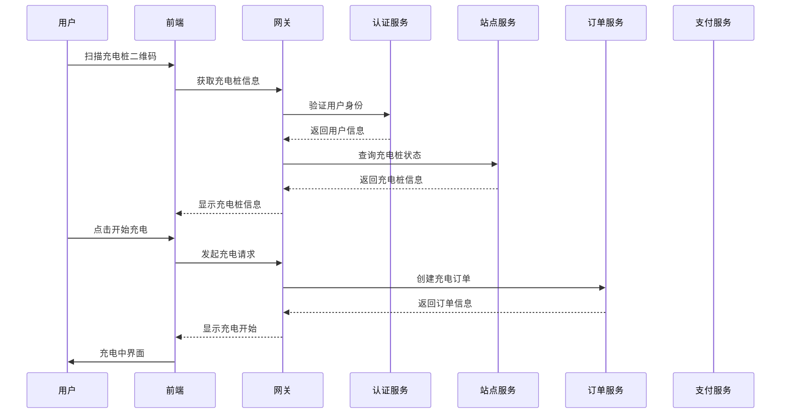
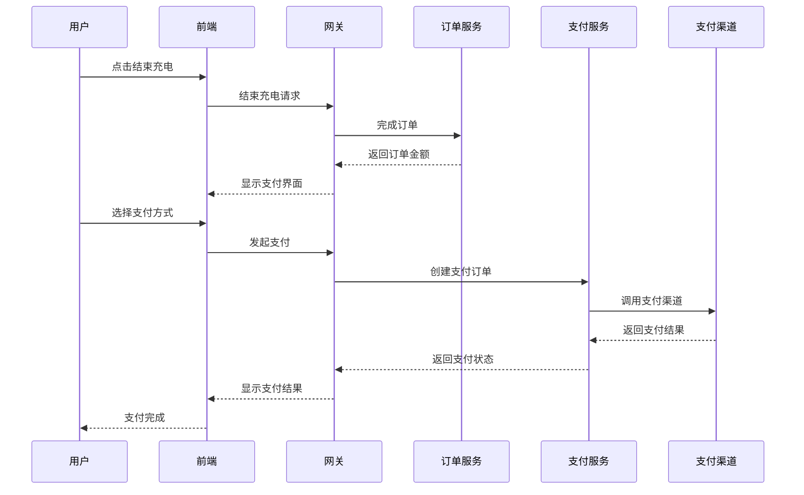

# EVCS Manager 充电站管理平台 - 产品需求文档 (PRD)

> **版本**: v2.0 | **更新日期**: 2025-11-02 | **状态**: 活跃

## 📋 产品概述

### 1.1 产品定位
EVCS Manager 是一个面向充电运营商的电动汽车充电站管理平台，提供完整的充电站运营管理解决方案，支持多租户架构，满足不同规模运营商的管理需求。

### 1.2 目标用户

#### 主要用户群体
1. **平台运营方** - 系统最高管理员
2. **充电运营商** - 区域充电站管理者
3. **站点管理员** - 单个充电站管理者
4. **最终用户** - 电动汽车车主

#### 用户特征
- 支持分层级的多租户管理模式
- 不同用户角色具有不同的数据访问权限
- 支持B2B2C商业模式

### 1.3 产品价值主张

#### 核心价值
1. **统一管理**: 集中管理多个充电站和充电桩
2. **多租户支持**: 支持不同规模运营商的独立运营
3. **实时监控**: 充电桩状态实时监控和故障告警
4. **智能计费**: 灵活的计费策略和自动结算
5. **数据驱动**: 完善的数据分析和报表功能

#### 竞争优势
- **架构先进**: 基于微服务架构，扩展性强
- **数据安全**: 四层数据隔离机制，安全可靠
- **协议兼容**: 支持OCPP等多种充电协议
- **支付集成**: 支持多种支付渠道
- **易于部署**: Docker容器化，快速部署

## 🎯 功能需求

### 2.1 核心功能模块

#### 2.1.1 用户认证与权限管理
**功能描述**: 提供完整的用户认证、授权和权限管理功能

**详细需求**:
- ✅ 用户注册、登录、注销
- ✅ 基于JWT的无状态认证
- ✅ 角色权限管理(RBAC)
- ✅ 多租户数据隔离
- ✅ 密码加密和安全策略
- ⚠️ 单点登录(SSO)支持
- ⚠️ 多因素认证(MFA)

**优先级**: P0 (必需)
**完成度**: 80%

#### 2.1.2 多租户管理
**功能描述**: 支持分层级的多租户架构，实现数据完全隔离

**详细需求**:
- ✅ 租户注册、审核、管理
- ✅ 层级租户关系(平台方→运营商→合作伙伴)
- ✅ 租户数据隔离(数据库、SQL、服务、API四层)
- ✅ 租户配置管理
- ✅ 租户状态控制(启用/禁用)
- ⚠️ 租户资源配额管理
- ⚠️ 租户计费和结算

**优先级**: P0 (必需)
**完成度**: 75%

#### 2.1.3 充电站管理
**功能描述**: 充电站和充电桩的基础信息管理

**详细需求**:
- ✅ 充电站CRUD操作
- ✅ 充电桩CRUD操作
- ✅ 地理位置管理(GPS坐标)
- ✅ 充电站状态管理
- ✅ 充电桩类型管理(快充/慢充/超充)
- ✅ 批量操作支持
- ✅ 附近充电站查询
- ⚠️ 充电站图片管理
- ⚠️ 充电站设施信息

**优先级**: P0 (必需)
**完成度**: 85%

#### 2.1.4 充电订单管理
**功能描述**: 完整的充电订单生命周期管理

**详细需求**:
- ✅ 订单创建(开始充电)
- ✅ 订单状态管理(充电中→已完成→已支付)
- ✅ 订单查询和统计
- ✅ 订单取消和退款
- ✅ 订单详情查看
- ⚠️ 预约充电功能
- ⚠️ 订单修改功能
- ❌ 订单发票管理

**优先级**: P0 (必需)
**完成度**: 70%

#### 2.1.5 计费管理
**功能描述**: 灵活的计费策略和方案管理

**详细需求**:
- ✅ 计费方案配置
- ✅ 分段计费(峰谷平电价)
- ✅ 服务费管理
- ✅ 停车费管理
- ✅ 计费方案缓存优化
- ⚠️ 会员价策略
- ⚠️ 优惠券系统
- ⚠️ 阶梯价格

**优先级**: P0 (必需)
**完成度**: 70%

### 2.2 商业功能模块

#### 2.2.1 支付集成
**功能描述**: 支持多种支付渠道的支付处理

**详细需求**:
- ✅ 支付宝集成(扫码/APP)
- ✅ 微信支付集成(扫码/小程序)
- ✅ 支付订单管理
- ✅ 支付状态查询
- ✅ 退款处理
- ❌ 支付回调处理
- ❌ 对账功能
- ❌ 分账功能

**优先级**: P1 (重要)
**完成度**: 15% ⚠️

#### 2.2.2 协议处理
**功能描述**: 支持充电桩通信协议

**详细需求**:
- ✅ OCPP 1.6协议支持
- ✅ 云快充协议支持
- ✅ 充电桩状态同步
- ✅ 充电会话管理
- ❌ 协议认证
- ❌ 远程控制功能
- ❌ 固件升级
- ❌ 故障诊断

**优先级**: P1 (重要)
**完成度**: 20% ⚠️

### 2.3 管理功能模块

#### 2.3.1 监控告警
**功能描述**: 系统和设备监控告警

**详细需求**:
- ✅ 充电桩状态监控
- ✅ 系统健康监控
- ✅ 性能指标监控
- ❌ 告警规则配置
- ❌ 告警通知(短信/邮件/钉钉)
- ❌ 监控仪表盘
- ❌ 故障自愈

**优先级**: P2 (普通)
**完成度**: 10% ⚠️

#### 2.3.2 数据分析
**功能描述**: 业务数据分析和报表

**详细需求**:
- ✅ 基础统计报表
- ✅ 充电站使用率统计
- ✅ 收入统计
- ⚠️ 用户行为分析
- ⚠️ 收益预测
- ❌ 自定义报表
- ❌ 数据导出

**优先级**: P2 (普通)
**完成度**: 30%

#### 2.3.3 系统管理
**功能描述**: 系统配置和运维管理

**详细需求**:
- ✅ 系统参数配置
- ✅ 日志管理
- ✅ 数据备份
- ⚠️ 操作审计
- ⚠️ 系统升级
- ❌ 性能调优
- ❌ 容灾备份

**优先级**: P2 (普通)
**完成度**: 40%

## 🔒 非功能性需求

### 3.1 性能需求

#### 3.1.1 系统性能指标
| 指标 | 目标值 | 当前值 | 状态 |
|------|--------|--------|------|
| 系统响应时间 | <200ms | ~264ms | ⚠️ 接近目标 |
| 并发用户数 | 1000+ | ~500 | ⚠️ 需要优化 |
| 充电站数量 | 500个 | 支持中 | ✅ |
| 充电桩数量 | 5000个 | 支持中 | ✅ |
| 数据库TPS | 1000+ | ~800 | ⚠️ 需要优化 |

#### 3.1.2 可用性需求
- **系统可用性**: 99.9%+ (年停机时间<8.76小时)
- **数据备份**: 每日自动备份，保留30天
- **故障恢复**: RTO<4小时，RPO<1小时

### 3.2 安全需求

#### 3.2.1 数据安全
- ✅ 数据传输加密(HTTPS/TLS)
- ✅ 数据存储加密
- ✅ 敏感数据脱敏
- ✅ 数据访问审计
- ✅ 多租户数据隔离

#### 3.2.2 系统安全
- ✅ 身份认证和授权
- ✅ API访问控制
- ✅ SQL注入防护
- ✅ XSS攻击防护
- ⚠️ API限流防护
- ⚠️ 安全扫描

### 3.3 兼容性需求

#### 3.3.1 浏览器兼容性
- ✅ Chrome 90+
- ✅ Firefox 88+
- ✅ Safari 14+
- ✅ Edge 90+

#### 3.3.2 移动端支持
- ✅ 响应式设计
- ⚠️ 移动端专用界面
- ❌ 移动端APP

### 3.4 扩展性需求

#### 3.4.1 水平扩展
- ✅ 微服务架构支持
- ✅ 负载均衡
- ✅ 数据库读写分离
- ⚠️ 缓存集群
- ⚠️ 消息队列集群

#### 3.4.2 功能扩展
- ✅ 插件化架构
- ✅ 配置化管理
- ⚠️ 第三方集成
- ⚠️ API开放平台

## 📊 业务流程

### 4.1 核心业务流程

#### 4.1.1 用户充电流程

#### 4.1.2 支付流程

### 4.2 管理流程

#### 4.2.1 租户管理流程
1. **租户注册**: 提交注册申请
2. **资料审核**: 平台方审核资质
3. **开通账户**: 创建租户账户
4. **初始化配置**: 设置基础参数
5. **培训支持**: 提供使用培训
6. **正式运营**: 开始独立运营

#### 4.2.2 充电站管理流程
1. **站点规划**: 确定充电站位置
2. **设备采购**: 采购充电桩设备
3. **安装调试**: 设备安装和调试
4. **系统接入**: 接入管理平台
5. **测试验收**: 功能测试验收
6. **正式运营**: 开始充电服务

## 🎯 产品路线图

### 5.1 短期目标 (3个月 - MVP版本)
**目标**: 实现核心充电站管理功能，支持基础运营

#### 功能范围
- ✅ 完善用户认证和权限管理
- ✅ 优化多租户数据隔离
- ✅ 完成充电站管理功能
- ✅ 实现基础订单管理
- 🔄 **重点**: 集成真实支付系统
- 🔄 **重点**: 提升测试覆盖率至80%+

#### 技术目标
- 测试覆盖率: 80%+
- 系统稳定性: 99%+
- 响应时间: <200ms
- 支付成功率: 95%+

### 5.2 中期目标 (6个月 - Beta版本)
**目标**: 实现商业化运营能力，支持规模化部署

#### 功能范围
- 完善支付集成(支付宝/微信SDK)
- 实现OCPP协议完整支持
- 建立监控告警体系
- 增加数据分析功能
- 完善移动端支持

#### 技术目标
- 系统可用性: 99.9%+
- 并发用户数: 1000+
- 充电站支持: 200个
- 充电桩支持: 2000个

### 5.3 长期目标 (12个月 - 生产版本)
**目标**: 实现商业化运营，支持大规模部署

#### 功能范围
- 完善的第三方集成
- 高级数据分析功能
- 移动端APP
- AI智能推荐
- 国际化支持

#### 技术目标
- 系统可用性: 99.95%+
- 并发用户数: 5000+
- 充电站支持: 500个
- 充电桩支持: 5000个

## 📈 成功指标

### 6.1 技术指标
- **系统稳定性**: 99.9%+
- **响应时间**: <200ms (95%请求)
- **测试覆盖率**: 80%+
- **代码质量**: SonarQube A级

### 6.2 业务指标
- **用户注册数**: 目标100+运营商
- **充电站接入**: 目标200+充电站
- **充电桩管理**: 目标2000+充电桩
- **月活跃用户**: 目标10000+车主

### 6.3 运营指标
- **订单完成率**: 95%+
- **支付成功率**: 98%+
- **系统故障率**: <0.1%
- **客户满意度**: 4.5+/5.0

## 🚨 风险与限制

### 7.1 技术风险
1. **支付系统集成复杂度**: 第三方SDK集成可能遇到技术难题
2. **协议兼容性**: 不同厂商充电桩协议差异较大
3. **性能瓶颈**: 大规模并发可能面临性能挑战
4. **数据安全**: 多租户数据隔离需要严格验证

### 7.2 业务风险
1. **市场需求变化**: 充电市场发展可能影响产品需求
2. **竞争加剧**: 同类产品竞争可能影响市场份额
3. **政策风险**: 充电政策变化可能影响产品设计
4. **用户接受度**: 新产品推广可能面临用户接受度挑战

### 7.3 项目限制
1. **开发资源**: 有限的开发人力资源
2. **时间压力**: 市场竞争要求快速上线
3. **技术债务**: 快速开发可能积累技术债务
4. **维护成本**: 系统维护和升级成本

## 📝 变更记录

| 版本 | 日期 | 变更内容 | 变更人 |
|------|------|----------|--------|
| v2.0 | 2025-11-02 | 基于项目现状全面重构PRD，合并多个需求文档 | Claude |
| v1.5 | 2025-10-20 | 更新项目状态，添加实际完成度评估 | Claude |
| v1.0 | 2025-10-01 | 初始版本，基于原始需求分析 | Team |

---

**相关文档**:
- [技术架构设计](./02-core/architecture.md)
- [API接口设计](./02-core/api-design.md)
- [开发计划](./05-planning/roadmap.md)
- [测试指南](./02-development/testing-guide.md)