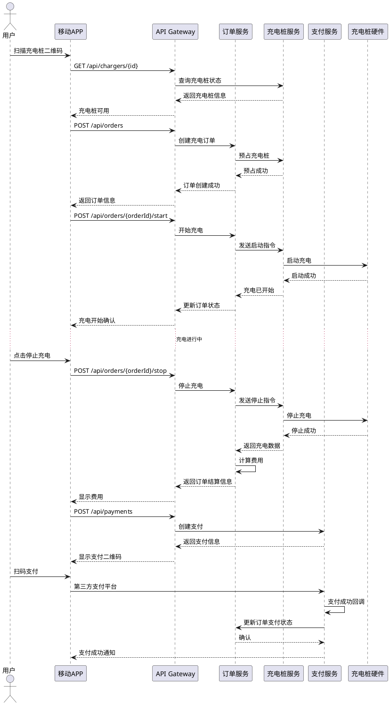
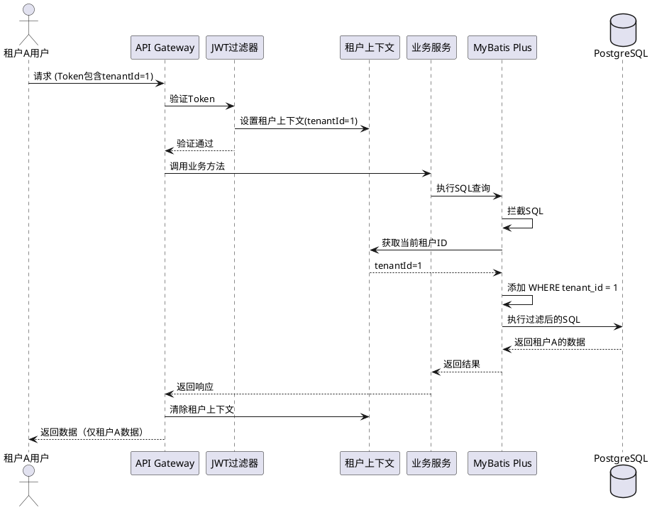

# EVCS Manager API 文档

> **最后更新**: 2025-11-07 | **维护者**: 技术负责人 | **状态**: 活跃
>
> **注意**: 部分API接口为模拟实现，支付相关API尚未完成

## 概述

本文档详细说明 EVCS Manager 系统的所有 REST API 接口，包括请求/响应示例、错误码说明和调用时序图。

**当前版本**: v1.0.0  
**基础URL**: `http://api.evcs-mgr.com`  
**认证方式**: JWT Bearer Token

---

## 目录

- [认证与授权](#认证与授权)
- [充电站管理](#充电站管理)
- [充电桩管理](#充电桩管理)
- [订单管理](#订单管理)
- [支付管理](#支付管理)
- [租户管理](#租户管理)
- [错误码说明](#错误码说明)
- [调用时序图](#调用时序图)

---

## 认证与授权

### 登录

**接口**: `POST /api/auth/login`

**请求示例**:
```json
{
  "username": "admin",
  "password": "password123",
  "tenantId": 1
}
```

**响应示例**:
```json
{
  "code": 200,
  "message": "登录成功",
  "data": {
    "token": "eyJhbGciOiJIUzI1NiIsInR5cCI6IkpXVCJ9...",
    "expireTime": "2025-10-13T10:30:00Z",
    "userInfo": {
      "userId": 1,
      "username": "admin",
      "tenantId": 1,
      "roles": ["ADMIN"]
    }
  }
}
```

### 刷新Token

**接口**: `POST /api/auth/refresh`

**请求头**:
```
Authorization: Bearer {token}
```

**响应示例**:
```json
{
  "code": 200,
  "message": "Token刷新成功",
  "data": {
    "token": "eyJhbGciOiJIUzI1NiIsInR5cCI6IkpXVCJ9...",
    "expireTime": "2025-10-13T11:30:00Z"
  }
}
```

---

## 充电站管理

### 创建充电站

**接口**: `POST /api/stations`

**权限**: `station:create`

**请求示例**:
```json
{
  "stationCode": "ST-BJ-001",
  "stationName": "北京朝阳充电站",
  "address": "北京市朝阳区xxx路123号",
  "latitude": 39.9087,
  "longitude": 116.4089,
  "province": "北京市",
  "city": "北京市",
  "district": "朝阳区",
  "status": 1
}
```

**响应示例**:
```json
{
  "code": 200,
  "message": "创建成功",
  "data": {
    "stationId": 1001,
    "stationCode": "ST-BJ-001",
    "stationName": "北京朝阳充电站",
    "tenantId": 1,
    "createTime": "2025-10-12T10:30:00Z"
  }
}
```

### 查询充电站列表

**接口**: `GET /api/stations`

**权限**: `station:query`

**请求参数**:
- `page` (int, optional): 页码，默认1
- `size` (int, optional): 每页数量，默认20，最大100
- `stationName` (string, optional): 充电站名称（模糊查询）
- `status` (int, optional): 状态（1-启用，0-停用）

**响应示例**:
```json
{
  "code": 200,
  "message": "查询成功",
  "data": {
    "records": [
      {
        "stationId": 1001,
        "stationCode": "ST-BJ-001",
        "stationName": "北京朝阳充电站",
        "address": "北京市朝阳区xxx路123号",
        "latitude": 39.9087,
        "longitude": 116.4089,
        "status": 1,
        "totalChargers": 10,
        "availableChargers": 7,
        "chargingChargers": 3,
        "faultChargers": 0
      }
    ],
    "total": 1,
    "page": 1,
    "size": 20
  }
}
```

### 查询附近充电站

**接口**: `GET /api/stations/nearby`

**权限**: `station:query`

**请求参数**:
- `latitude` (double, required): 纬度
- `longitude` (double, required): 经度
- `radius` (double, optional): 搜索半径（公里），默认5km
- `limit` (int, optional): 返回数量，默认10

**响应示例**:
```json
{
  "code": 200,
  "message": "查询成功",
  "data": [
    {
      "stationId": 1001,
      "stationName": "北京朝阳充电站",
      "distance": 0.8,
      "availableChargers": 7,
      "latitude": 39.9087,
      "longitude": 116.4089
    }
  ]
}
```

---

## 充电桩管理

### 创建充电桩

**接口**: `POST /api/chargers`

**权限**: `charger:create`

**请求示例**:
```json
{
  "stationId": 1001,
  "chargerCode": "CHG-001",
  "chargerName": "1号充电桩",
  "chargerType": 1,
  "ratedPower": 60.0,
  "status": 1
}
```

**响应示例**:
```json
{
  "code": 200,
  "message": "创建成功",
  "data": {
    "chargerId": 10001,
    "chargerCode": "CHG-001",
    "chargerName": "1号充电桩",
    "stationId": 1001,
    "createTime": "2025-10-12T10:30:00Z"
  }
}
```

### 更新充电桩状态

**接口**: `PUT /api/chargers/{chargerId}/status`

**权限**: `charger:update`

**请求示例**:
```json
{
  "status": 2
}
```

**状态值说明**:
- 0: 离线
- 1: 空闲
- 2: 充电中
- 3: 故障

**响应示例**:
```json
{
  "code": 200,
  "message": "状态更新成功",
  "data": {
    "chargerId": 10001,
    "status": 2,
    "updateTime": "2025-10-12T10:35:00Z"
  }
}
```

---

## 订单管理

### 创建充电订单

**接口**: `POST /api/orders`

**权限**: `order:create`

**请求示例**:
```json
{
  "chargerId": 10001,
  "userId": 1,
  "vehicleId": "京A12345",
  "estimatedDuration": 60
}
```

**响应示例**:
```json
{
  "code": 200,
  "message": "订单创建成功",
  "data": {
    "orderId": "ORD-202510120001",
    "chargerId": 10001,
    "status": 1,
    "createTime": "2025-10-12T10:30:00Z",
    "estimatedEndTime": "2025-10-12T11:30:00Z"
  }
}
```

### 开始充电

**接口**: `POST /api/orders/{orderId}/start`

**权限**: `order:control`

**响应示例**:
```json
{
  "code": 200,
  "message": "充电已开始",
  "data": {
    "orderId": "ORD-202510120001",
    "status": 2,
    "startTime": "2025-10-12T10:32:00Z"
  }
}
```

### 停止充电

**接口**: `POST /api/orders/{orderId}/stop`

**权限**: `order:control`

**响应示例**:
```json
{
  "code": 200,
  "message": "充电已停止",
  "data": {
    "orderId": "ORD-202510120001",
    "status": 3,
    "stopTime": "2025-10-12T11:15:00Z",
    "totalEnergy": 35.6,
    "totalAmount": 78.32,
    "duration": 43
  }
}
```

### 查询订单详情

**接口**: `GET /api/orders/{orderId}`

**权限**: `order:query`

**响应示例**:
```json
{
  "code": 200,
  "message": "查询成功",
  "data": {
    "orderId": "ORD-202510120001",
    "chargerId": 10001,
    "userId": 1,
    "status": 4,
    "totalEnergy": 35.6,
    "totalAmount": 78.32,
    "paidAmount": 78.32,
    "paymentStatus": 2,
    "createTime": "2025-10-12T10:30:00Z",
    "startTime": "2025-10-12T10:32:00Z",
    "stopTime": "2025-10-12T11:15:00Z",
    "payTime": "2025-10-12T11:16:30Z"
  }
}
```

---

## 支付管理

### 创建支付

**接口**: `POST /api/payments`

**权限**: `payment:create`

**请求示例**:
```json
{
  "orderId": "ORD-202510120001",
  "paymentMethod": "WECHAT",
  "amount": 78.32
}
```

**响应示例**:
```json
{
  "code": 200,
  "message": "支付创建成功",
  "data": {
    "paymentId": "PAY-202510120001",
    "orderId": "ORD-202510120001",
    "amount": 78.32,
    "paymentUrl": "weixin://wxpay/bizpayurl?pr=xxx",
    "expireTime": "2025-10-12T11:30:00Z"
  }
}
```

### 支付回调

**接口**: `POST /api/payments/callback/{provider}`

**说明**: 由第三方支付平台回调，无需手动调用

**Provider参数**:
- `wechat`: 微信支付
- `alipay`: 支付宝
- `union`: 银联支付

---

## 租户管理

### 创建租户

**接口**: `POST /api/tenants`

**权限**: `tenant:create` (系统管理员专用)

**请求示例**:
```json
{
  "tenantName": "示例运营商",
  "contactName": "张三",
  "contactPhone": "13800138000",
  "contactEmail": "zhangsan@example.com",
  "parentTenantId": null
}
```

**响应示例**:
```json
{
  "code": 200,
  "message": "租户创建成功",
  "data": {
    "tenantId": 2,
    "tenantName": "示例运营商",
    "createTime": "2025-10-12T10:30:00Z"
  }
}
```

---

## 错误码说明

### HTTP状态码

| 状态码 | 说明 |
|--------|------|
| 200 | 请求成功 |
| 201 | 创建成功 |
| 204 | 删除成功（无内容返回） |
| 400 | 请求参数错误 |
| 401 | 未认证（未登录或Token过期） |
| 403 | 无权限访问 |
| 404 | 资源不存在 |
| 409 | 资源冲突（如重复创建） |
| 500 | 服务器内部错误 |
| 503 | 服务暂时不可用 |

### 业务错误码

| 错误码 | 说明 | HTTP状态 |
|--------|------|----------|
| 1001 | 充电站编码重复 | 409 |
| 1002 | 充电站不存在 | 404 |
| 1003 | 充电站状态异常 | 400 |
| 2001 | 充电桩编码重复 | 409 |
| 2002 | 充电桩不存在 | 404 |
| 2003 | 充电桩状态异常（如正在充电中） | 400 |
| 2004 | 充电桩离线 | 400 |
| 3001 | 订单不存在 | 404 |
| 3002 | 订单状态异常（如已完成的订单不能再次开始） | 400 |
| 3003 | 订单已取消 | 400 |
| 4001 | 支付失败 | 500 |
| 4002 | 支付超时 | 408 |
| 4003 | 支付金额不匹配 | 400 |
| 5001 | 租户不存在 | 404 |
| 5002 | 租户上下文缺失 | 401 |
| 5003 | 跨租户访问被拒绝 | 403 |
| 9999 | 系统内部错误 | 500 |

### 错误响应示例

```json
{
  "code": 2003,
  "message": "充电桩状态异常：充电桩正在充电中，无法操作",
  "data": {
    "chargerId": 10001,
    "currentStatus": 2,
    "orderId": "ORD-202510120001"
  },
  "timestamp": "2025-10-12T10:35:00Z",
  "path": "/api/chargers/10001/status"
}
```

---

## 调用时序图

### 充电流程时序图



### 租户隔离调用流程



---

## Swagger文档导出

系统集成了Swagger/OpenAPI 3.0，可访问以下地址查看交互式API文档：

**开发环境**: `http://localhost:8080/doc.html`  
**生产环境**: `https://api.evcs-mgr.com/doc.html`

### 导出JSON格式

访问: `http://localhost:8080/v3/api-docs`

### 导出YAML格式

访问: `http://localhost:8080/v3/api-docs.yaml`

---

## 更新日志

| 版本 | 日期 | 更新内容 |
|------|------|----------|
| 1.0.0 | 2025-10-12 | 初始版本，包含核心API文档 |

---

## 联系方式

**技术支持**: tech-support@evcs-mgr.com  
**API问题反馈**: api-feedback@evcs-mgr.com  
**GitHub Issues**: https://github.com/Big-Dao/evcs-mgr/issues

