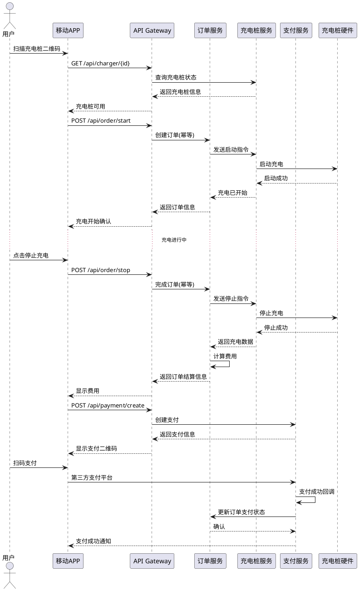
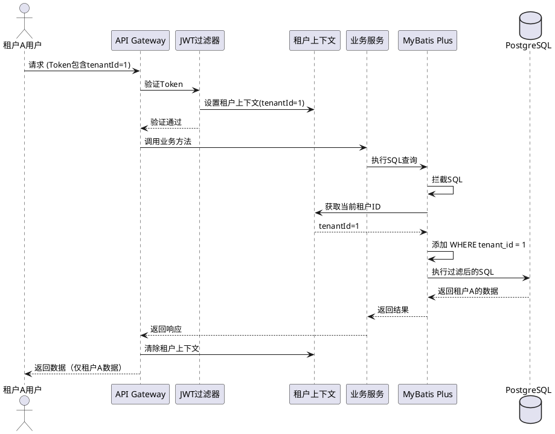
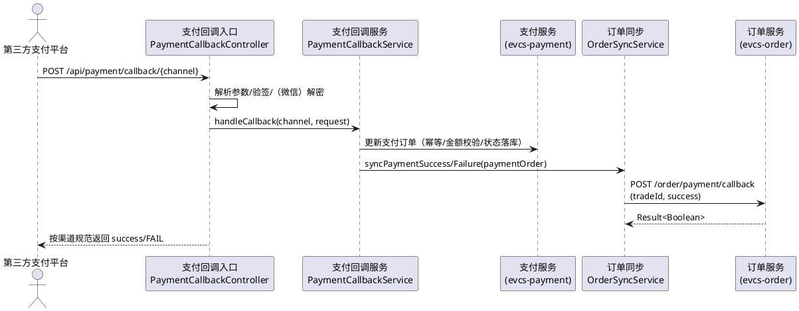

# EVCS Manager API 文档

> **版本**: v1.3 | **最后更新**: 2026-02-10 | **维护者**: 技术负责人 | **状态**: 活跃
>
> ⚠️ **注意**: 以网关路由与服务控制器为准；完整接口以 Swagger/OpenAPI 输出为权威来源。

## 1. 概述

本文档说明 EVCS Manager 的主要 REST API 接口与调用约定，覆盖认证、站点、充电桩、订单、支付、租户、监控、协议等模块。

**当前版本**: v1.0.0  \
**本地网关**: `http://localhost:8080`  \
**认证方式**: JWT Bearer Token

说明：
- 业务接口默认通过网关 `http://localhost:8080/api/**` 访问。
- 协议服务的设备接口目前为直连 `evcs-protocol`（未在网关聚合）。

## 2. 认证与授权

### 2.1 登录

**接口**: `POST /api/auth/login`

**请求示例**:
```json
{
  "identifier": "admin@tenant1",
  "password": "password"
}
```

**响应示例**:
```json
{
  "code": 200,
  "message": "登录成功",
  "data": {
    "token": "eyJhbGciOiJIUzI1NiIsInR5cCI6IkpXVCJ9...",
    "expireTime": "2026-02-10T10:30:00Z",
    "userInfo": {
      "userId": 1,
      "username": "admin",
      "tenantId": 1,
      "identifier": "admin@tenant1",
      "roles": ["ADMIN"]
    }
  }
}
```

### 2.2 用户信息

**接口**: `GET /api/auth/userinfo`

**请求头**:
```
Authorization: Bearer {token}
```

说明：当前实现允许从 `Authorization` 或 `X-User-Id`/`X-Tenant-Id` 中解析上下文。

## 3. C 端用户管理

C 端用户模块为规划中服务 `evcs-user`，接口定义详见 [evcs-user 模块 RFC](../architecture/EVCS-USER-MODULE-RFC.md)。

## 4. 充电站管理

### 4.1 接口概览

| 接口 | 方法 | 说明 |
| --- | --- | --- |
| `/api/station` | `POST` | 新增充电站 |
| `/api/station/{stationId}` | `PUT` | 更新充电站 |
| `/api/station/{stationId}` | `DELETE` | 删除充电站 |
| `/api/station/{stationId}` | `GET` | 查询充电站详情 |
| `/api/station` | `GET` | 分页/列表查询（含 `/page`、`/list`） |
| `/api/station/nearby` | `GET` | 查询附近充电站 |
| `/api/station/{stationId}/status` | `PUT` | 启用/停用充电站 |
| `/api/station/check-code` | `GET` | 校验站点编码 |
| `/api/station/count` | `GET` | 统计充电站数量 |

### 4.2 查询附近充电站

**接口**: `GET /api/station/nearby`

**请求参数**:
- `latitude` (double, required)
- `longitude` (double, required)
- `radius` (double, optional, 默认 10)
- `limit` (int, optional, 默认 20)

## 5. 充电桩管理

### 5.1 接口概览

| 接口 | 方法 | 说明 |
| --- | --- | --- |
| `/api/charger` | `POST` | 新增充电桩 |
| `/api/charger` | `PUT` | 更新充电桩 |
| `/api/charger/{chargerId}` | `DELETE` | 删除充电桩 |
| `/api/charger/{chargerId}` | `GET` | 查询充电桩详情 |
| `/api/charger` | `GET` | 分页/列表查询（含 `/page`、`/list`） |
| `/api/charger/{chargerId}/status` | `PUT` | 更新充电桩状态（`status` 参数） |
| `/api/charger/{chargerId}/connectors/{connectorNo}/start` | `POST` | 启动充电（按枪口） |
| `/api/charger/{chargerId}/connectors/{connectorNo}/stop` | `POST` | 停止充电（按枪口） |
| `/api/charger/{chargerId}/reset` | `POST` | 设备复位 |
| `/api/charger/{chargerId}/enable` | `PUT` | 启用/停用充电桩 |
| `/api/charger/offline` | `GET` | 离线设备列表 |
| `/api/charger/fault` | `GET` | 故障设备列表 |
| `/api/charger/statistics` | `GET` | 统计信息 |

## 6. 订单管理

### 6.1 订单状态说明（关键业务过程）

订单状态字段 `status` 由订单服务 `ChargingOrder` 定义，常见流转为：

`0(已创建/充电中)` → `1(已结束/已完成计量)` → `10(待支付)` → `11(已支付)`

退款相关：`12(退款中)` → `13(已退款)`；取消：`2(已取消)`。

### 6.2 接口概览

| 接口 | 方法 | 说明 |
| --- | --- | --- |
| `/api/order` | `GET` | 分页/列表查询（`/page`、`/list`） |
| `/api/order/by-session` | `GET` | 按会话查询订单 |
| `/api/order/{id}` | `GET` | 根据 ID 查询订单 |
| `/api/order/start` | `POST` | 协议事件：开始充电创建订单（幂等） |
| `/api/order/stop` | `POST` | 协议事件：停止充电完成订单（幂等） |
| `/api/order/{orderId}/to-pay` | `POST` | 进入待支付 |
| `/api/order/{orderId}/paid` | `POST` | 标记已支付 |
| `/api/order/{orderId}/cancel` | `POST` | 取消订单 |
| `/api/order/{orderId}/refunding` | `POST` | 标记退款中 |
| `/api/order/{orderId}/refunded` | `POST` | 标记已退款 |
| `/api/order/payment/callback` | `POST` | 支付回调通知（内部） |
| `/api/order/statistics/city` | `GET` | 城市级统计 |

## 7. 支付管理

### 7.1 接口概览

| 接口 | 方法 | 说明 |
| --- | --- | --- |
| `/api/payment/create` | `POST` | 创建支付 |
| `/api/payment/query/{tradeNo}` | `GET` | 查询支付状态 |
| `/api/payment/refund` | `POST` | 退款 |
| `/api/payment/callback/alipay` | `POST` | 支付宝回调 |
| `/api/payment/callback/wechat` | `POST` | 微信回调 |
| `/api/payment/callback/alipay/refund` | `POST` | 支付宝退款回调 |
| `/api/payment/callback/wechat/refund` | `POST` | 微信退款回调 |
| `/api/reconciliation/execute` | `POST` | 手工对账 |
| `/api/reconciliation/daily/{channel}` | `POST` | 每日对账 |

说明：支付回调与退款回调由第三方支付平台调用，无需手工触发。

## 8. 租户管理

### 8.1 租户接口

| 接口 | 方法 | 说明 |
| --- | --- | --- |
| `/api/tenant` | `POST` | 创建租户 |
| `/api/tenant/{id}` | `PUT` | 更新租户 |
| `/api/tenant/{id}` | `DELETE` | 删除租户 |
| `/api/tenant/{id}` | `GET` | 查询租户 |
| `/api/tenant/list` | `GET` | 租户列表 |
| `/api/tenant/page` | `GET` | 租户分页 |
| `/api/tenant/{parentId}/children` | `GET` | 子租户列表 |
| `/api/tenant/tree` | `GET` | 租户树 |
| `/api/tenant/{id}/status` | `PUT` | 启用/停用租户 |
| `/api/tenant/check-code` | `GET` | 校验租户编码 |

### 8.2 配额与审计

| 接口 | 方法 | 说明 |
| --- | --- | --- |
| `/api/tenant/quota/usage/{tenantId}` | `GET` | 查询配额使用 |
| `/api/tenant/quota/{tenantId}` | `PUT` | 更新配额 |
| `/api/tenant/quota/check/create-child/{parentId}` | `GET` | 校验创建子租户 |
| `/api/tenant/quota/check/add-station/{tenantId}` | `GET` | 校验新增站点 |
| `/api/tenant/quota/check/add-charger/{tenantId}` | `GET` | 校验新增充电桩 |
| `/api/tenant/quota/check/add-user/{tenantId}` | `GET` | 校验新增用户 |
| `/api/tenant/audit-log/page` | `GET` | 审计日志分页 |
| `/api/tenant/audit-log/actions` | `GET` | 审计动作列表 |
| `/api/tenant/audit-log/statistics/cross-layer` | `GET` | 跨层级访问统计 |

### 8.3 Dashboard

| 接口 | 方法 | 说明 |
| --- | --- | --- |
| `/api/dashboard/stats` | `GET` | 统计摘要（兼容 `/statistics`、`/summary`） |
| `/api/dashboard/charger-status` | `GET` | 充电桩状态统计 |
| `/api/dashboard/charging-trend` | `GET` | 充电趋势 |
| `/api/dashboard/revenue-trend` | `GET` | 收入趋势 |
| `/api/dashboard/order-period-distribution` | `GET` | 订单时段分布 |
| `/api/dashboard/recent-orders` | `GET` | 近期订单 |
| `/api/dashboard/station-ranking` | `GET` | 站点排行 |
| `/api/dashboard/charger-utilization` | `GET` | 桩使用率 |

### 8.4 内部接口

| 接口 | 方法 | 说明 |
| --- | --- | --- |
| `/internal/api/v1/tenant-hierarchy/descendant` | `GET` | 查询下级租户（内部） |

## 9. 监控服务

监控服务由网关透传至 `evcs-monitoring`，支持 `/api/monitoring/**` 与 `/api/v1/monitoring/**`。

| 接口 | 方法 | 说明 |
| --- | --- | --- |
| `/api/monitoring/overview` | `GET` | 监控总览 |
| `/api/monitoring/versions` | `GET` | 服务版本汇总 |
| `/api/monitoring/services/health` | `GET` | 服务健康聚合 |
| `/api/monitoring/services/{serviceName}/health` | `GET` | 指定服务健康 |
| `/api/monitoring/metrics/system` | `GET` | 系统指标 |
| `/api/monitoring/metrics/performance` | `GET` | 性能指标 |
| `/api/monitoring/metrics/business` | `GET` | 业务指标 |
| `/api/monitoring/alerts` | `GET` | 告警列表 |
| `/api/monitoring/alerts/{id}` | `GET` | 告警详情 |
| `/api/monitoring/alerts/{id}/acknowledge` | `POST` | 确认告警 |
| `/api/monitoring/alerts/{id}/resolve` | `POST` | 关闭告警 |
| `/api/monitoring/alerts/statistics` | `GET` | 告警统计 |
| `/api/monitoring/logs/realtime` | `GET` | 实时日志 |
| `/api/monitoring/logs/search` | `GET` | 日志搜索 |

## 10. 协议服务

云快充协议接口为设备直连 `evcs-protocol`，当前未在网关聚合：

| 接口 | 方法 | 说明 |
| --- | --- | --- |
| `/api/cloudcharge/heartbeat` | `POST` | 心跳上报 |
| `/api/cloudcharge/status` | `POST` | 状态上报 |
| `/api/cloudcharge/start` | `POST` | 开始充电 |
| `/api/cloudcharge/stop` | `POST` | 停止充电 |

协议调试接口：`/debug/protocol/**`（内部联调使用）。

## 11. 错误码说明

错误码以 [错误码规范](../overview/ERROR-CODE-STANDARDS.md) 为准。本节仅给出通用示例。

### 11.1 HTTP 状态码

| 状态码 | 说明 |
| --- | --- |
| 200 | 请求成功 |
| 400 | 请求参数错误 |
| 401 | 未认证 |
| 403 | 无权限访问 |
| 404 | 资源不存在 |
| 409 | 资源冲突 |
| 500 | 服务器内部错误 |
| 503 | 服务暂时不可用 |

### 11.2 错误响应示例

```json
{
  "code": 2003,
  "message": "充电桩状态异常：充电桩正在充电中，无法操作",
  "data": {
    "chargerId": 10001,
    "currentStatus": 2,
    "orderId": "ORD-202510120001"
  },
  "timestamp": "2026-02-10T10:35:00Z",
  "path": "/api/charger/10001/status"
}
```

## 12. 调用时序图

### 12.1 充电流程时序图


```plantuml
@startuml
actor 用户 as User
participant "移动APP" as App
participant "API Gateway" as Gateway
participant "订单服务" as Order
participant "充电桩服务" as Charger
participant "支付服务" as Payment
participant "充电桩硬件" as Hardware

User -> App: 扫描充电桩二维码
App -> Gateway: GET /api/charger/{id}
Gateway -> Charger: 查询充电桩状态
Charger --> Gateway: 返回充电桩信息
Gateway --> App: 充电桩可用

App -> Gateway: POST /api/order/start
Gateway -> Order: 创建订单(幂等)
Order -> Charger: 发送启动指令
Charger -> Hardware: 启动充电
Hardware --> Charger: 启动成功
Charger --> Order: 充电已开始
Order --> Gateway: 返回订单信息
Gateway --> App: 充电开始确认

... 充电进行中 ...

User -> App: 点击停止充电
App -> Gateway: POST /api/order/stop
Gateway -> Order: 完成订单(幂等)
Order -> Charger: 发送停止指令
Charger -> Hardware: 停止充电
Hardware --> Charger: 停止成功
Charger --> Order: 返回充电数据
Order -> Order: 计算费用
Order --> Gateway: 返回订单结算信息
Gateway --> App: 显示费用

App -> Gateway: POST /api/payment/create
Gateway -> Payment: 创建支付
Payment --> Gateway: 返回支付信息
Gateway --> App: 显示支付二维码

User -> App: 扫码支付
App -> Payment: 第三方支付平台
Payment -> Payment: 支付成功回调
Payment -> Order: 更新订单支付状态
Order --> Payment: 确认
Payment --> App: 支付成功通知

@enduml
```

### 12.2 租户隔离调用流程


```plantuml
@startuml
actor 租户A用户 as UserA
participant "API Gateway" as Gateway
participant "JWT过滤器" as JWT
participant "租户上下文" as Context
participant "业务服务" as Service
participant "MyBatis Plus" as MP
database "PostgreSQL" as DB

UserA -> Gateway: 请求 (Token包含tenantId=1)
Gateway -> JWT: 验证Token
JWT -> Context: 设置租户上下文(tenantId=1)
JWT --> Gateway: 验证通过

Gateway -> Service: 调用业务方法
Service -> MP: 执行SQL查询
MP -> MP: 拦截SQL
MP -> Context: 获取当前租户ID
Context --> MP: tenantId=1
MP -> MP: 添加 WHERE tenant_id = 1
MP -> DB: 执行过滤后的SQL
DB --> MP: 返回租户A的数据
MP --> Service: 返回结果
Service --> Gateway: 返回响应
Gateway -> Context: 清除租户上下文
Gateway --> UserA: 返回数据（仅租户A数据）

@enduml
```

### 12.3 支付回调处理流程（现行实现）


```plantuml
@startuml
actor "第三方支付平台" as PSP
participant "支付回调入口\nPaymentCallbackController" as Callback
participant "支付回调服务\nPaymentCallbackService" as CallbackSvc
participant "支付服务\n(evcs-payment)" as Payment
participant "订单同步\nOrderSyncService" as Sync
participant "订单服务\n(evcs-order)" as Order

PSP -> Callback: POST /api/payment/callback/{channel}
Callback -> Callback: 解析参数/验签/（微信）解密
Callback -> CallbackSvc: handleCallback(channel, request)
CallbackSvc -> Payment: 更新支付订单（幂等/金额校验/状态落库）
CallbackSvc -> Sync: syncPaymentSuccess/Failure(paymentOrder)
Sync -> Order: POST /order/payment/callback\n(tradeId, success)
Order --> Sync: Result<Boolean>
Callback --> PSP: 按渠道规范返回 success/FAIL
@enduml
```

## 13. Swagger/OpenAPI

接口文档由各服务输出，常用入口如下：

- Swagger UI: `http://localhost:<service-port>/swagger-ui.html`
- OpenAPI JSON: `http://localhost:<service-port>/v3/api-docs`

示例（Auth 服务）：
- `http://localhost:8081/swagger-ui.html`
- `http://localhost:8081/v3/api-docs`

## 14. 更新日志

| 版本 | 日期 | 更新内容 |
| --- | --- | --- |
| 1.3 | 2026-02-10 | 与实际控制器/网关路由对齐，修订路径与模块说明 |
| 1.0 | 2025-10-12 | 初始版本 |

## 15. 联系方式

**技术支持**: tech-support@evcs-mgr.com  \
**API问题反馈**: api-feedback@evcs-mgr.com
